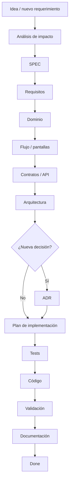
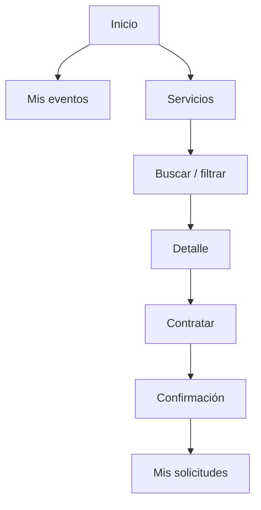
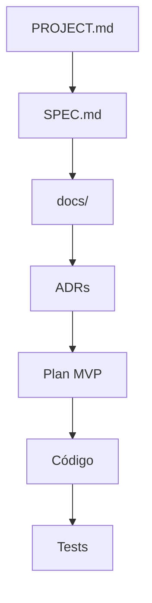
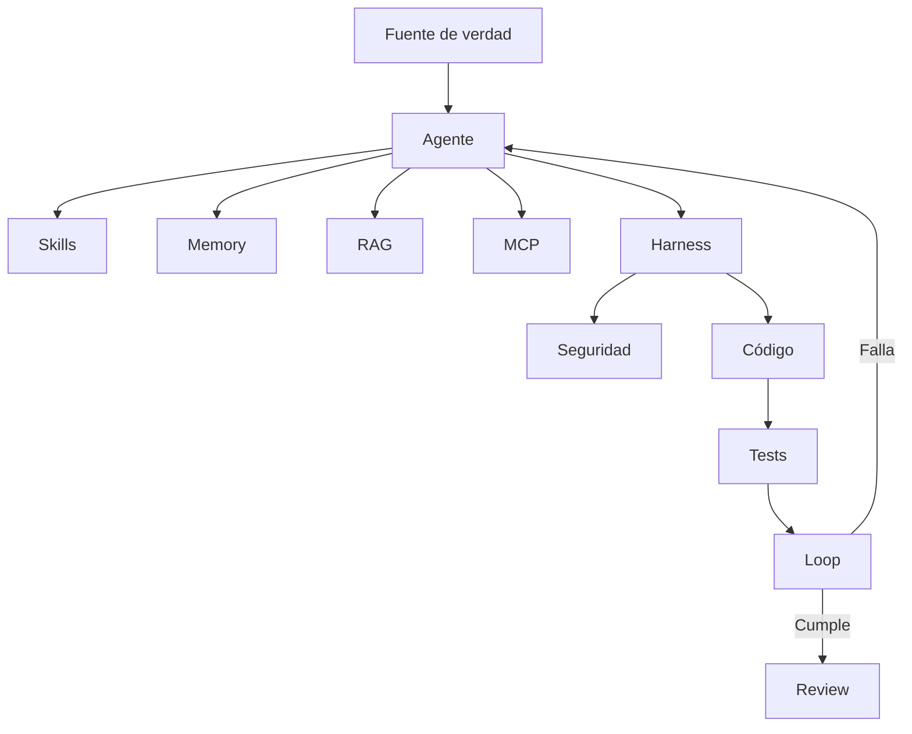
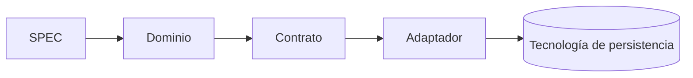

# EVENTOS SOCIALES — Project Context

> Documento de entrada para cualquier persona o agente que retome el proyecto.

## Propósito

Construir un MVP para administrar servicios relacionados con eventos sociales, con una arquitectura mantenible, testeable y preparada para ser desarrollada por humanos o distintos agentes de IA.

## Principio rector

> **El repositorio define el producto; el agente ejecuta tareas dentro de esas reglas.**

El proyecto debe ser LLM-agnóstico y, siempre que sea razonable, lenguaje-agnóstico en sus especificaciones, contratos y documentación.

## Fuente de verdad

La fuente de verdad está distribuida de forma intencional:

1. `SPEC.md` — comportamiento y alcance del producto.
2. `docs/` — visión, requisitos, arquitectura, datos, API y arquitectura de agentes.
3. `docs/decisions/` — decisiones técnicas y sus consecuencias.
4. Tests — evidencia ejecutable del comportamiento esperado.

`PROJECT.md` **no sustituye** estas fuentes. Es un índice operativo para recuperar contexto.

## Regla de evolución de funcionalidades

Ninguna funcionalidad nueva debe comenzar directamente con código. Primero se realiza un análisis de impacto sobre:

- SPEC;
- requisitos y criterios de aceptación;
- dominio y reglas de negocio;
- experiencia y flujo de usuario;
- contratos/API;
- arquitectura;
- datos y persistencia;
- seguridad;
- ADRs;
- tests;
- documentación.

El resultado del análisis determina qué documentos necesitan cambios. No todos deben modificarse en cada tarea.



## Diseño de interfaz y pantallas

Las funcionalidades que tengan interacción web deben documentar, cuando sea útil, una representación aproximada de sus pantallas antes de la implementación.

Estas representaciones son **wireframes conceptuales**, no diseños visuales finales ni código. Pueden expresarse mediante Mermaid, ASCII u otra representación textual adecuada.

Ejemplo conceptual para la contratación de un servicio:

```mermaid
flowchart LR
    LIST[Servicios disponibles\n----------------\nFotografía\nCatering\nMúsica]
    --> DETAIL[Detalle del servicio\n----------------\nDescripción\nProveedor\nCondiciones\n[Contratar]]
    --> CONFIRM[Confirmar contratación\n----------------\nServicio\nEvento\nDatos\n[Confirmar]]
    --> RESULT[Resultado\n----------------\nSolicitud registrada\nEstado: SOLICITADA]
```

Cuando una pantalla tenga suficiente complejidad, se podrá complementar con un diagrama de navegación:



Los wireframes deben mantenerse separados de las decisiones tecnológicas: no deben asumir React, Angular, Vue, HTML concreto u otro framework salvo que exista una decisión de implementación vigente.

## Arquitectura documental



## Arquitectura de desarrollo con agentes

El proyecto contempla:

- SPEC
- Skills
- Harness
- Memory
- Seguridad
- Orquestación
- Loops
- RAG
- Tests unitarios
- Documentación
- MCP
- ADR

No todas estas capacidades tienen que estar implementadas en el MVP. La arquitectura distingue entre **capacidad diseñada** y **capacidad implementada**.



## LLM

El proyecto no depende de un proveedor específico. Puede ser trabajado por ChatGPT, Codex, GitHub Copilot, Claude, otros agentes compatibles o desarrolladores humanos.

Las instrucciones específicas de cada herramienta son una capa de adaptación y no deben convertirse en la fuente de verdad del producto.

## Estado actual

### Completado

- Visión y requisitos documentados.
- Arquitectura inicial documentada.
- Modelo de datos documentado.
- API documentada.
- Arquitectura de agentes documentada.
- Plan MVP documentado.
- ADR-001: persistencia inicial.
- ADR-002: separación dominio/persistencia.
- ADR-003: arquitectura LLM-agnóstica.
- ADR-004: estrategia de arquitectura y contratos agnósticos al lenguaje aceptada.
- Base de seguridad y tests documentada.
- `PROJECT.md`: contexto de continuidad del proyecto.
- Regla de análisis de impacto y wireframes conceptuales.

### Pendiente

1. Crear ADR de stack de implementación concreta.
2. Completar MVP-00 — Fundación.
3. Crear el primer vertical slice.
4. Establecer CI y ejecución automatizada de tests.
5. Implementar gradualmente Skills, Harness, Loops, Memory, MCP, RAG y orquestación según necesidad real.

## Regla para cambios tecnológicos

Un cambio de base de datos, lenguaje o framework no debe provocar una reescritura completa de la documentación.

Los requisitos funcionales deben permanecer estables cuando el comportamiento del producto no cambie. Las decisiones tecnológicas se registran mediante nuevos ADRs o reemplazo explícito de ADRs anteriores.



## Definition of Done

Una tarea no está terminada solamente porque el código compile. Debe comprobarse, según corresponda:

- requisito identificado;
- análisis de impacto realizado;
- alcance respetado;
- criterios de aceptación satisfechos;
- flujo/pantallas documentados cuando aplique;
- tests relevantes creados o actualizados;
- tests ejecutados;
- seguridad revisada cuando aplique;
- documentación actualizada cuando corresponda;
- ADR actualizado o creado si existe una decisión arquitectónica relevante.

## Cómo retomar el proyecto

Un nuevo agente o desarrollador debe leer, en este orden:

```text
1. PROJECT.md
2. SPEC.md
3. docs/02-requisitos.md
4. docs/03-arquitectura.md
5. docs/06-arquitectura-agentes.md
6. docs/07-plan-mvp.md
7. ADRs relevantes
8. estado real del código y tests
```

Después debe identificar la siguiente tarea pendiente antes de modificar código.

## Regla de seguridad

No incluir secretos, credenciales, tokens, claves privadas ni información sensible en este documento ni en el repositorio.

## Última actualización

2026-08-28
