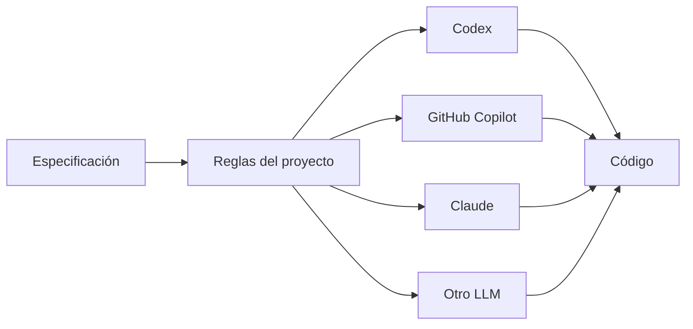
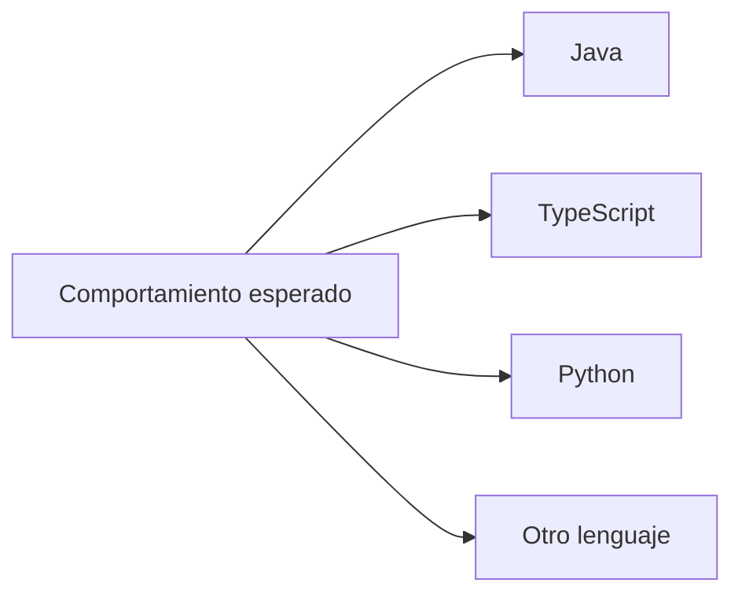
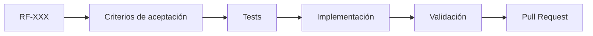

# SPEC — MVP Administración de Eventos Sociales

## 1. Propósito

Construir una aplicación para administrar eventos sociales, servicios y proveedores.

Esta especificación define **qué comportamiento debe proporcionar el producto**, no cómo debe implementarse.

La implementación puede utilizar distintos lenguajes, frameworks, plataformas o asistentes de IA siempre que preserve el comportamiento especificado.

## 2. Fuente de verdad

El comportamiento del producto se define conjuntamente por:

- este `SPEC.md`;
- requisitos de `docs/02-requisitos.md`;
- arquitectura y decisiones documentadas en `docs/`;
- criterios de aceptación;
- tests automatizados.

Las instrucciones para agentes de IA se encuentran en `ai/` y sirven para ejecutar el proceso de ingeniería; no redefinen el negocio.

## 3. Alcance inicial

### Funcionalidades MVP

- Registrar clientes.
- Consultar clientes.
- Registrar eventos.
- Consultar eventos.
- Modificar eventos.
- Registrar proveedores.
- Consultar proveedores.
- Registrar servicios asociados a eventos.
- Relacionar proveedores con servicios.
- Gestionar el estado de un servicio.

## 4. Conceptos principales

### Evento

Representa un evento social que requiere uno o varios servicios.

### Servicio

Actividad o prestación contratada o requerida para un evento.

### Proveedor

Persona o empresa que proporciona un servicio para un evento.

### Cliente

Persona u organización que contrata o solicita la realización del evento.

### Responsable

Persona que coordina o da seguimiento a un servicio.

## 5. Estados iniciales del servicio

- PENDIENTE
- CONFIRMADO
- EN_PROCESO
- FINALIZADO
- CANCELADO

Las transiciones definitivas deben estar respaldadas por reglas de dominio documentadas.

## 6. Reglas de negocio iniciales

- Un cliente debe tener un identificador único.
- Un cliente debe tener nombre o razón social.
- Un evento debe tener una fecha.
- Un evento debe tener un nombre o descripción.
- Un evento debe estar asociado a un cliente válido.
- Un servicio debe estar asociado a un evento.
- Un servicio debe tener un estado válido.
- Un proveedor asociado debe existir.
- Un proveedor puede participar en uno o varios servicios.
- Los cambios de estado deben respetar las reglas definidas por el dominio.

## 7. Independencia tecnológica

Los requisitos no deben especificar:

- clases o funciones concretas;
- nombres de archivos de implementación;
- frameworks;
- lenguajes;
- proveedores de IA;
- estructura física de la base de datos;

salvo cuando una decisión técnica ya documentada sea necesaria para implementar una capacidad concreta.

## 8. Independencia del LLM

El producto debe poder desarrollarse con diferentes herramientas de IA.

Ningún LLM es requisito funcional del producto.

## 9. Independencia del lenguaje

El lenguaje concreto pertenece a la implementación y no al dominio.

## 10. Fuera del alcance del MVP

- Pagos en línea.
- Facturación electrónica.
- Aplicación móvil nativa.
- Automatizaciones avanzadas con IA.
- Integraciones externas no necesarias para validar el MVP.

## 11. Criterio general de aceptación

Una funcionalidad se considera terminada cuando:

1. Cumple este SPEC.
2. Cumple los criterios de aceptación asociados.
3. Tiene pruebas automatizadas apropiadas.
4. Las pruebas existentes continúan pasando.
5. Respeta las reglas de ingeniería del repositorio.
6. La documentación se actualiza cuando el cambio modifica comportamiento o arquitectura.

## 12. Trazabilidad

