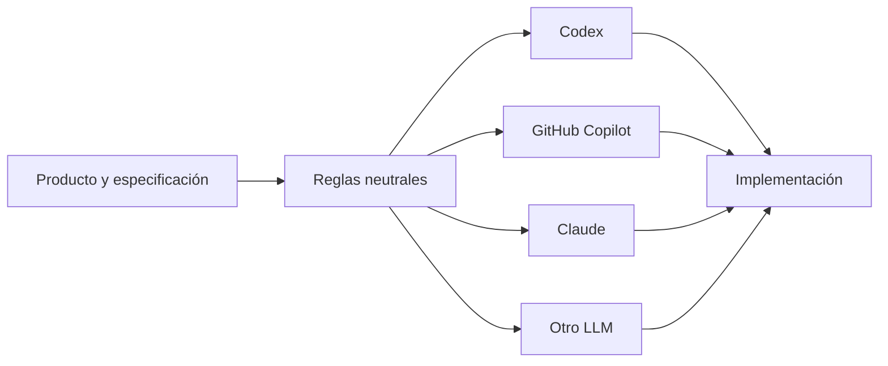

# Capa de colaboración con IA

## Propósito

Esta carpeta contiene reglas, flujos y prompts neutrales respecto al proveedor de LLM.

El proyecto no debe depender de un modelo concreto para definir su comportamiento. Codex, GitHub Copilot, Claude u otro LLM son herramientas que consumen la especificación del repositorio.

## Fuente de verdad

La fuente de verdad del producto está en:

- `SPEC.md`
- `docs/`
- criterios de aceptación
- decisiones arquitectónicas documentadas
- tests automatizados

Los archivos de esta carpeta **no sustituyen** esas fuentes.

## Estructura

```text
ai/
├── README.md
├── instructions/
│   ├── coding-rules.md
│   ├── testing-rules.md
│   └── workflow.md
├── prompts/
│   ├── implement-feature.md
│   ├── create-tests.md
│   └── review-code.md
└── adapters/
    ├── codex.md
    ├── copilot.md
    └── claude.md
```

## Principio de portabilidad



## Independencia del lenguaje

Las reglas funcionales y de negocio no deben depender de Java, TypeScript, Python, PHP u otro lenguaje.

La implementación puede cambiar de lenguaje mientras conserve el comportamiento definido por la especificación y validado por tests.

## Adaptadores

Los archivos `adapters/` solamente describen cómo expresar o cargar las reglas neutrales en una herramienta concreta. No deben introducir reglas de negocio propias.
