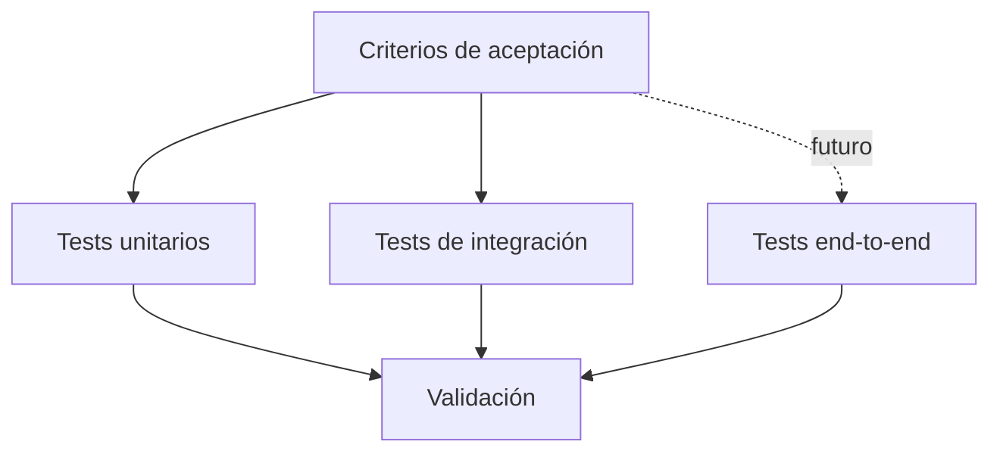

# Reglas de pruebas

## Objetivo

Las pruebas deben verificar comportamiento, reglas y contratos, no una implementación concreta.

## Principios

1. Cada requisito funcional importante debe tener criterios de aceptación verificables.
2. Las reglas de negocio deben probarse preferentemente de forma aislada.
3. Los tests no deben depender de detalles internos innecesarios.
4. Los casos de error son parte del comportamiento esperado.
5. Una prueba que falla debe investigarse; no debe eliminarse para conseguir una ejecución verde.

## Capas



## Independencia del lenguaje

La especificación del comportamiento puede expresarse de forma neutral, por ejemplo con escenarios BDD/Gherkin. Cada lenguaje podrá utilizar su framework de pruebas apropiado.

```gherkin
Scenario: Registrar un servicio válido
  Given existe un evento válido
  When se registra un servicio válido
  Then el servicio queda asociado al evento
  And su estado inicial es PENDIENTE
```

El framework concreto se decide por la implementación tecnológica y no por el requisito.

## Regla para agentes

Antes de modificar una prueba existente, determinar si el comportamiento esperado cambió. No adaptar tests únicamente para hacer coincidir una implementación incorrecta.
