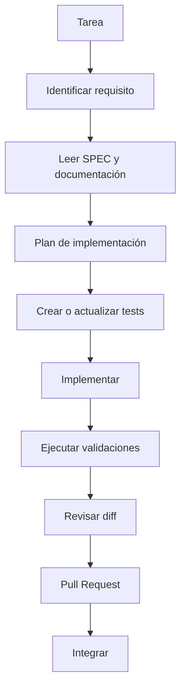

# Flujo de trabajo asistido por IA

## Flujo estándar

## Reglas

1. El agente debe explicar qué requisito está implementando.
2. Si falta una decisión de negocio, debe solicitarla en lugar de inventarla.
3. Si encuentra una contradicción documental, debe señalarla.
4. Debe preservar compatibilidad con comportamiento existente salvo que el requisito indique lo contrario.
5. Debe ejecutar las validaciones disponibles antes de entregar el cambio.
6. Debe reportar explícitamente cualquier validación que no pudo ejecutar.

## Independencia del agente

Este flujo puede ejecutarse con Codex, GitHub Copilot, Claude u otro LLM. La herramienta concreta solamente cambia la forma de interacción, no el proceso de ingeniería.

## Independencia del lenguaje

El flujo es aplicable a cualquier lenguaje. Los comandos concretos de compilación, linting y tests dependen de la implementación y deben estar documentados por el proyecto cuando se conozcan.
