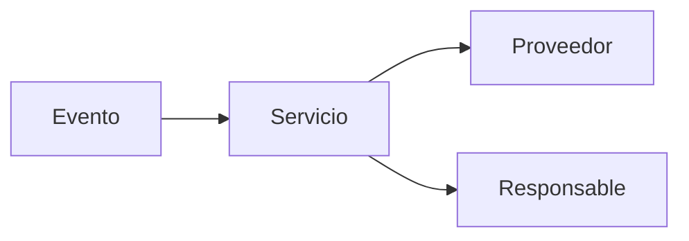
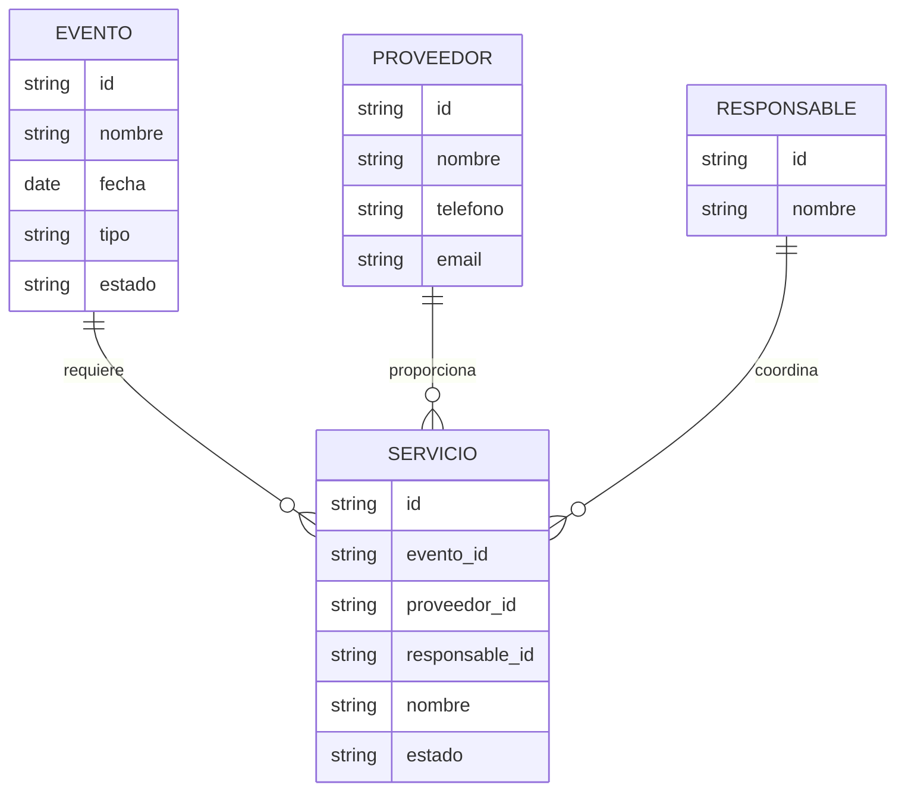
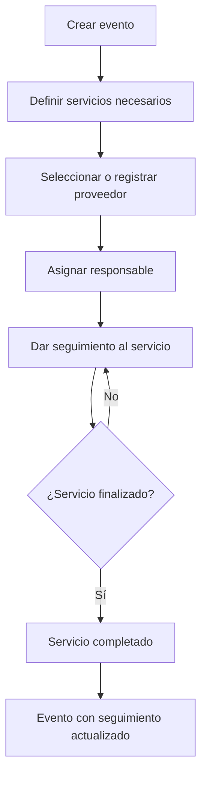

# 01 — Visión del producto

## 1. Propósito

`eventos-sociales` es una aplicación web orientada a la administración de servicios y proveedores necesarios para organizar eventos sociales.

El MVP busca centralizar la información operativa que normalmente se dispersa entre conversaciones, hojas de cálculo y notas, permitiendo conocer qué evento existe, qué servicios requiere, quién los proporciona y en qué estado se encuentra cada servicio.

## 2. Problema que queremos resolver

La organización de un evento social involucra múltiples servicios y proveedores. Cuando la información se administra de manera manual o en diferentes medios, aumenta el riesgo de:

- perder información;
- olvidar servicios pendientes;
- no saber quién es responsable de un servicio;
- duplicar registros;
- desconocer el estado real de contratación o ejecución;
- tener información desactualizada.

El sistema debe proporcionar una fuente central de información para la operación del evento.

## 3. Visión

> Administrar un evento social como un conjunto de servicios coordinados, manteniendo trazabilidad de proveedores, responsables y estados desde la planeación hasta la finalización.

## 4. Conceptos principales

El dominio inicial se organiza alrededor de cuatro conceptos:

### Evento

Representa la celebración que se está organizando.

Ejemplos: boda, XV años, cumpleaños, aniversario o evento corporativo/social.

### Servicio

Representa una necesidad concreta del evento que debe ser contratada, coordinada o ejecutada.

Ejemplos: banquete, fotografía, música, decoración, salón, transporte.

### Proveedor

Persona o empresa que ofrece un servicio.

### Responsable

Persona encargada de dar seguimiento operativo al servicio dentro de la organización del evento.

## 5. Relación conceptual

Un evento puede requerir muchos servicios y cada servicio puede estar asociado con un proveedor y un responsable.

> Este diagrama representa el modelo conceptual inicial. Los atributos definitivos se establecerán en `04-modelo-datos.md`.

## 6. Alcance del MVP

El MVP debe permitir como mínimo:

1. registrar eventos;
2. consultar eventos;
3. modificar eventos;
4. registrar servicios asociados a un evento;
5. consultar los servicios de un evento;
6. modificar servicios;
7. registrar y administrar proveedores;
8. asociar proveedores con servicios;
9. asignar responsables;
10. controlar el estado de los servicios;
11. consultar información operativa de un evento.

## 7. Flujo operativo principal

## 8. Estados iniciales

### Estado del servicio

El MVP utilizará inicialmente:

- `PENDIENTE`
- `CONFIRMADO`
- `EN_PROCESO`
- `FINALIZADO`
- `CANCELADO`

Las reglas de transición se definirán en `02-requisitos.md` y `SPEC.md`.

### Estado del evento

Se propone inicialmente:

- `PLANIFICACION`
- `ACTIVO`
- `FINALIZADO`
- `CANCELADO`

Estos estados son una propuesta de dominio y deberán validarse antes de considerarlos definitivos.

## 9. Principios del producto

### Simplicidad

El MVP debe resolver primero el problema operativo principal sin incorporar funciones innecesarias.

### Trazabilidad

Cada servicio debe poder relacionarse con su evento, proveedor, responsable y estado.

### Evolución gradual

La arquitectura debe permitir sustituir o evolucionar componentes técnicos sin rediseñar todo el dominio.

### Calidad desde el inicio

Las funcionalidades nuevas deberán acompañarse de pruebas automatizadas apropiadas.

### Desarrollo asistido por agentes

La documentación, especificaciones y reglas del repositorio deben permitir que agentes como Codex comprendan el contexto del proyecto y trabajen con restricciones claras.

## 10. Fuera del MVP inicial

Quedan fuera del primer MVP, salvo que posteriormente se aprueben explícitamente:

- pagos en línea;
- facturación electrónica;
- aplicación móvil nativa;
- marketplace público de proveedores;
- inteligencia artificial para planificación automática;
- integración con múltiples plataformas de mensajería;
- contabilidad;
- recomendaciones automáticas avanzadas.

## 11. Criterio de éxito del MVP

Consideraremos que el MVP cumple su objetivo cuando una persona pueda registrar un evento, definir sus servicios, relacionar proveedores y responsables, y consultar el estado operativo de esos servicios desde una única aplicación.

## 12. Próximo documento

El siguiente paso es transformar esta visión en requisitos verificables en `02-requisitos.md`.
