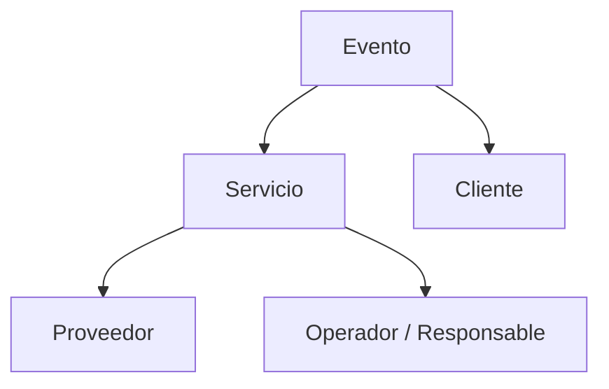
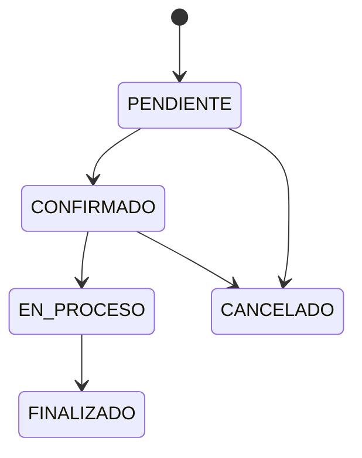
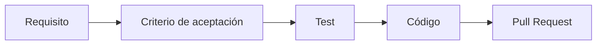

# Requisitos del MVP

## 1. Objetivo

Este documento transforma la visión del producto en requisitos verificables. Cada requisito debe poder relacionarse posteriormente con uno o más criterios de aceptación y tests.

## 2. Actores

- **Administrador:** configura y administra la información del sistema.
- **Operador:** registra, consulta y actualiza la operación cotidiana.
- **Cliente:** persona u organización que contrata o solicita la realización del evento. El acceso directo del cliente a la aplicación se considera una capacidad futura y no forma parte todavía del MVP.

## 3. Conceptos funcionales

### 3.1 Evento

Representa la ocasión para la cual se contratan o coordinan servicios.

### 3.2 Servicio

Representa una actividad o prestación requerida para un evento.

### 3.3 Proveedor

Representa a la persona o empresa que proporciona un servicio.

### 3.4 Cliente

Representa a la persona que contrata o solicita la organización del evento.

## 4. Requisitos funcionales

### RF-000 — Registrar cliente

El sistema debe permitir registrar un cliente con la información mínima definida por el modelo de datos.

**Criterios de aceptación:**

- El cliente debe tener identificador único.
- Debe registrar nombre o razón social.
- Puede registrar datos de contacto básicos.
- No debe permitirse guardar información obligatoria vacía.

### RF-000A — Consultar cliente

El sistema debe permitir consultar un cliente registrado mediante su identificador.

**Criterios de aceptación:**

- Debe existir el identificador consultado.
- Debe devolver la información registrada del cliente.
- Un identificador inexistente debe producir un resultado controlado.

### RF-001 — Registrar evento

El sistema debe permitir registrar un evento con la información mínima definida por el modelo de datos.

**Criterios de aceptación:**

- El evento debe tener identificador único.
- Debe registrar cliente.
- Debe registrar fecha del evento.
- Debe registrar un estado válido.
- No debe permitirse guardar información obligatoria vacía.

### RF-002 — Consultar eventos

El sistema debe permitir consultar eventos registrados.

**Criterios de aceptación:**

- Debe mostrar los eventos existentes.
- Debe permitir identificar cada evento.
- Debe permitir consultar su estado.

### RF-003 — Actualizar evento

El sistema debe permitir modificar información de un evento existente.

**Criterios de aceptación:**

- Debe identificar el evento mediante su identificador.
- Debe conservar la identidad del evento.
- Debe validar nuevamente los campos obligatorios.

### RF-004 — Registrar servicio

El sistema debe permitir registrar un servicio asociado a un evento.

**Criterios de aceptación:**

- El servicio debe estar asociado a un evento válido.
- Debe tener un tipo o descripción.
- Debe tener un estado válido.
- Debe poder asociarse un proveedor cuando corresponda.

### RF-005 — Consultar servicios de un evento

El sistema debe permitir consultar los servicios asociados a un evento.

**Criterios de aceptación:**

- La consulta debe mostrar únicamente los servicios relacionados con el evento seleccionado.
- Cada servicio debe mostrar su estado.
- Debe ser posible identificar al proveedor asociado cuando exista.

### RF-006 — Actualizar servicio

El sistema debe permitir modificar la información de un servicio.

**Criterios de aceptación:**

- El servicio debe existir.
- Los datos modificados deben validarse.
- La relación con el evento debe mantenerse.

### RF-007 — Registrar proveedor

El sistema debe permitir registrar proveedores.

**Criterios de aceptación:**

- El proveedor debe tener identificador único.
- Debe registrar nombre o razón social.
- Debe permitir registrar datos de contacto básicos.

### RF-008 — Asociar proveedor a servicio

El sistema debe permitir asociar un proveedor existente a un servicio.

**Criterios de aceptación:**

- El proveedor debe existir.
- El servicio debe existir.
- La asociación debe quedar registrada.

### RF-009 — Gestionar estados del servicio

El sistema debe controlar el estado de un servicio mediante un conjunto definido de estados.

Estados iniciales propuestos:

- PENDIENTE
- CONFIRMADO
- EN_PROCESO
- FINALIZADO
- CANCELADO

**Criterios de aceptación:**

- No se deben aceptar estados fuera del catálogo.
- Las transiciones inválidas deben rechazarse.
- Las reglas de transición deben estar documentadas antes de implementarse.

> Las transiciones anteriores son una propuesta inicial y deberán validarse contra el proceso real antes de considerarse definitivas.

## 5. Requisitos no funcionales

### RNF-001 — Seguridad

No se deben almacenar credenciales, tokens o API keys en el repositorio.

### RNF-002 — Mantenibilidad

El código debe mantenerse separado por responsabilidades y seguir las reglas definidas en `AGENTS.md`.

### RNF-003 — Pruebas

Toda nueva funcionalidad debe incorporar tests apropiados.

### RNF-004 — Trazabilidad

Los requisitos deben poder relacionarse con criterios de aceptación, tests y cambios de código.

### RNF-005 — Integración continua

Los tests automatizados deberán ejecutarse mediante GitHub Actions antes de integrar cambios en `main`, cuando la infraestructura de ejecución esté configurada.

## 6. Fuera del alcance inicial

No forman parte del MVP inicial, salvo decisión posterior:

- Facturación.
- Pagos en línea.
- Aplicación móvil nativa.
- Inteligencia artificial para recomendaciones.
- Integraciones externas complejas.
- Automatizaciones avanzadas de comunicación.
- Portal de autoservicio del cliente.

## 7. Trazabilidad futura

Los identificadores `RF-*` y `RNF-*` se conservarán estables para poder utilizarlos en nombres de tests, issues, Pull Requests y documentación.

Ejemplo:

`RF-000` → `test_registrar_cliente` → implementación de registro de cliente.
