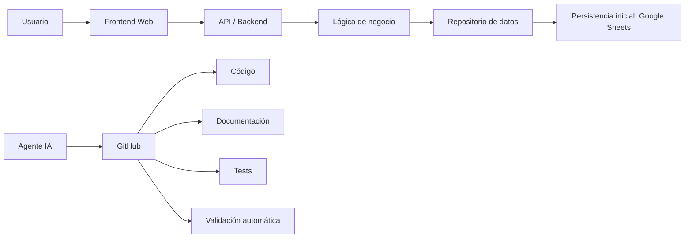
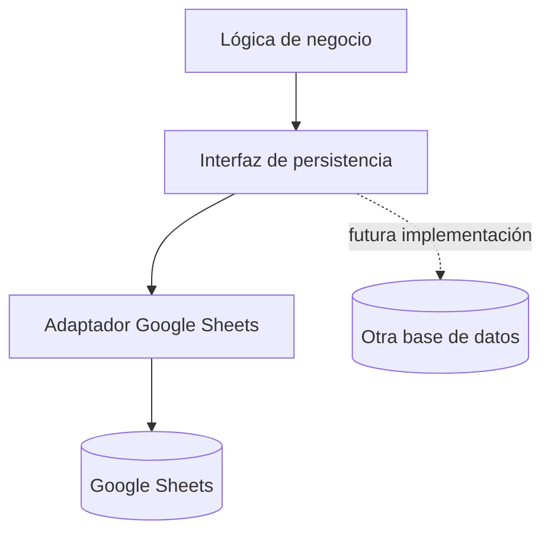
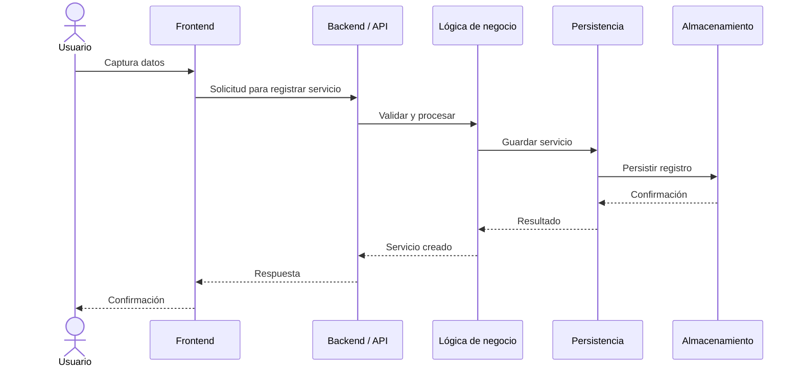
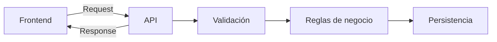
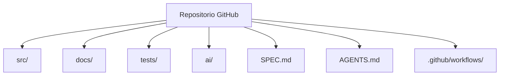
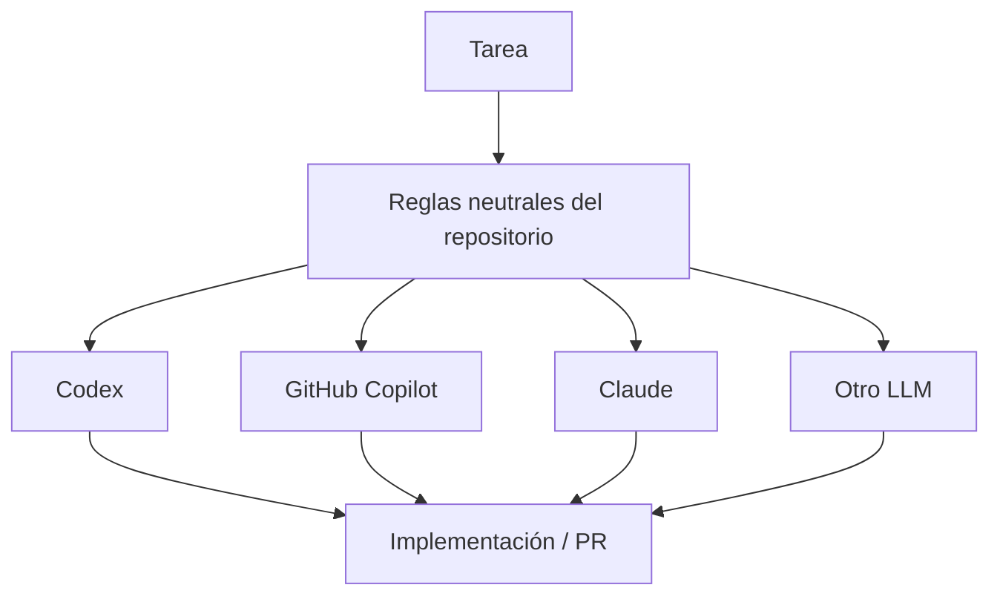
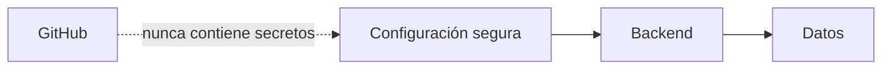

# Arquitectura técnica del MVP

## 1. Objetivo

Definir una arquitectura sencilla, mantenible y preparada para evolucionar sin introducir complejidad innecesaria en el MVP.

La primera implementación utiliza frontend web, Google Apps Script y Google Sheets, pero las reglas del dominio deben permanecer desacopladas de estas tecnologías cuando sea razonable.

La arquitectura deberá permitir una futura migración del almacenamiento o backend sin rediseñar el dominio funcional.

## 2. Principios

1. **MVP primero:** resolver el problema antes de introducir infraestructura innecesaria.
2. **Separación de responsabilidades:** interfaz, lógica de negocio y persistencia no deben mezclarse.
3. **API como frontera:** el frontend no debe depender directamente de la estructura interna de Google Sheets.
4. **Testabilidad:** la lógica de negocio debe poder probarse sin depender de una interfaz gráfica o de una hoja real.
5. **Evolución:** Google Sheets es la persistencia inicial, no una decisión irreversible para todas las etapas del producto.
6. **Seguridad:** ningún secreto debe almacenarse en GitHub.
7. **Trazabilidad:** requisitos, código, tests y cambios deben poder relacionarse.
8. **Portabilidad:** las reglas de negocio no deben depender de un LLM ni de un lenguaje de programación.

## 3. Arquitectura de alto nivel



La tecnología concreta de `API / Backend` y `Persistencia` pertenece a la implementación. Para el MVP actual se utiliza Google Apps Script + Google Sheets.

## 4. Capas

### 4.1 Frontend

Responsable de:

- presentar información;
- capturar datos del usuario;
- realizar validaciones básicas de interfaz;
- consumir la API;
- mostrar errores y resultados.

El frontend no debe contener reglas de negocio críticas que también deban cumplirse en el backend.

### 4.2 API / Backend

La implementación inicial utiliza Google Apps Script como frontera HTTP entre el frontend y la lógica del sistema.

Responsabilidades:

- recibir solicitudes;
- validar entradas;
- aplicar reglas de negocio;
- consultar o modificar datos;
- devolver respuestas consistentes.

### 4.3 Lógica de negocio

Contendrá las reglas que definen el comportamiento del dominio.

Ejemplos:

- validar un evento;
- validar un servicio;
- comprobar estados;
- asociar un proveedor;
- impedir operaciones inválidas.

Esta capa debe diseñarse de forma que pueda probarse sin depender directamente de Google Sheets.

### 4.4 Persistencia

Google Sheets será el almacenamiento inicial del MVP.

La aplicación no debe acoplar las reglas de negocio a las coordenadas concretas de celdas. El acceso a hojas debe quedar aislado en una capa de persistencia.



## 5. Flujo de una operación

Ejemplo: registrar un servicio.



## 6. Contrato entre frontend y backend

El frontend deberá comunicarse con el backend mediante contratos definidos en `docs/05-api.md`.



La estructura interna de Google Sheets no debe formar parte del contrato público del frontend.

## 7. GitHub como centro del proyecto

GitHub será el sistema central para código, documentación y colaboración.



## 8. Agentes de IA

La arquitectura del producto no depende de un proveedor de IA.



`AGENTS.md` funciona como punto de entrada para herramientas que lo soporten. Las reglas neutrales viven en `ai/instructions/` y los flujos reutilizables en `ai/prompts/`.

Los adaptadores específicos de herramientas se mantienen en `ai/adapters/` y no deben redefinir reglas de negocio.

## 9. Tests

La arquitectura debe permitir al menos tres niveles de validación:

```text
Tests unitarios
    ↓
Lógica de negocio

Tests de integración
    ↓
API + persistencia controlada

Tests end-to-end (futuro)
    ↓
Frontend + API + entorno de prueba
```

Para el MVP se priorizan los tests unitarios y los tests de integración esenciales.

El framework de pruebas depende del lenguaje elegido para la implementación.

## 10. Seguridad

### No se almacenará en GitHub

- API keys.
- Tokens.
- Contraseñas.
- Credenciales de servicios.
- Información sensible de clientes o proveedores.

### Principio



## 11. Evolución prevista

### Etapa MVP

```text
Frontend
   ↓
Apps Script
   ↓
Google Sheets
```

### Etapa posterior posible

```text
Frontend
   ↓
API / Backend
   ↓
Base de datos
```

La migración deberá ser una decisión basada en necesidades reales como volumen, concurrencia, seguridad, rendimiento, disponibilidad o integración con otros sistemas.

## 12. Decisiones pendientes

Las siguientes decisiones no deben inventarse todavía:

- estructura definitiva de entidades y columnas;
- autenticación y autorización;
- reglas completas de transición de estados;
- formato definitivo de errores de API;
- estrategia de despliegue;
- necesidad de una base de datos distinta de Google Sheets;
- estrategia de auditoría;
- lenguaje y framework definitivos si la implementación evoluciona.

Estas decisiones se documentarán conforme avance el diseño.

## 13. Criterio arquitectónico del MVP

Una solución se considera adecuada para el MVP cuando:

- es sencilla de desplegar;
- separa interfaz, negocio y persistencia;
- puede probarse automáticamente;
- no expone secretos;
- permite modificar la persistencia sin reescribir el dominio;
- puede ser mantenida por una persona y asistida por diferentes agentes de IA;
- mantiene trazabilidad entre requisitos, tests y código;
- no depende de un lenguaje o proveedor de LLM específico a nivel de negocio.
