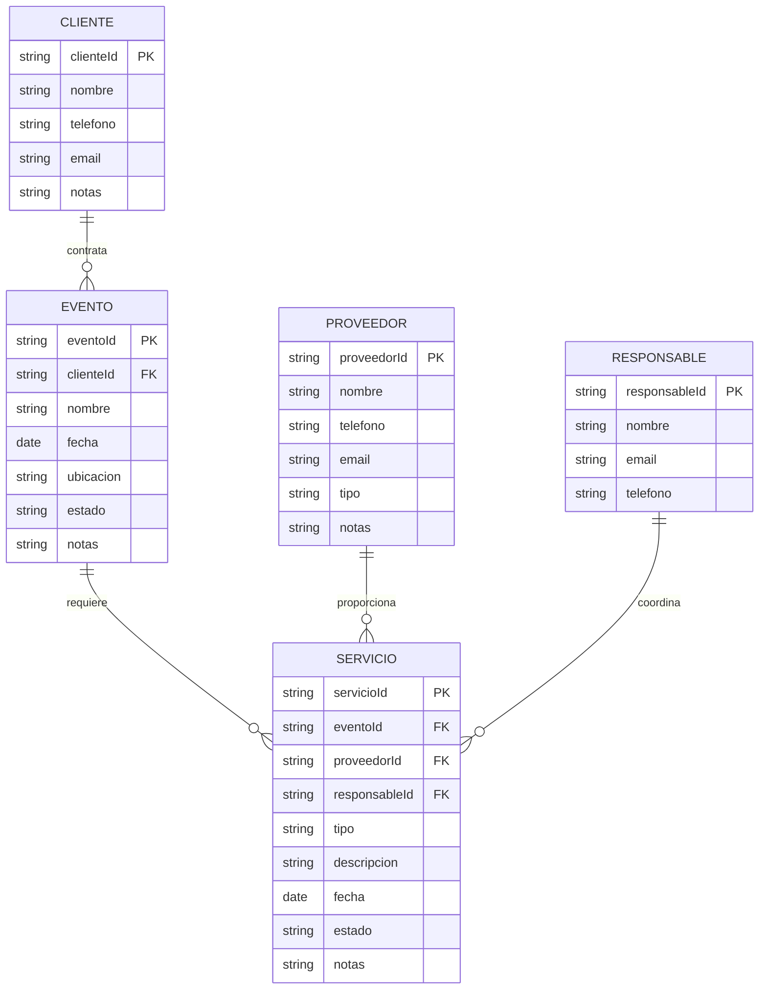
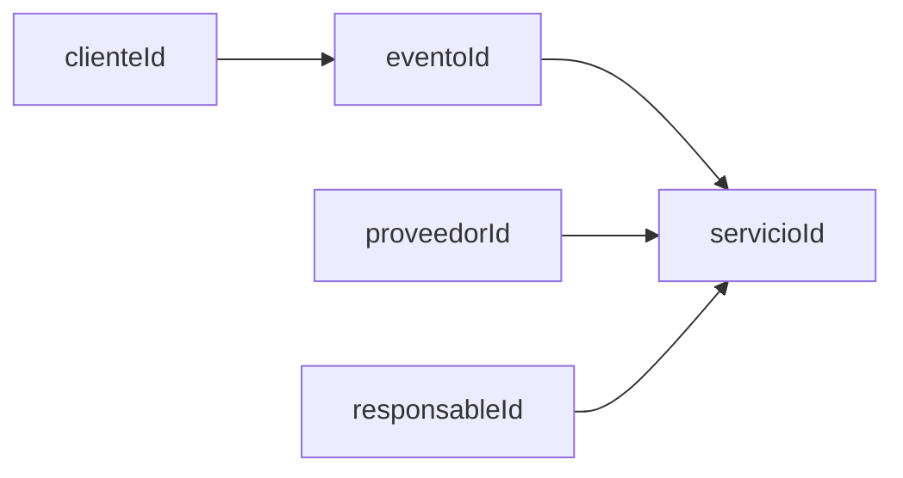
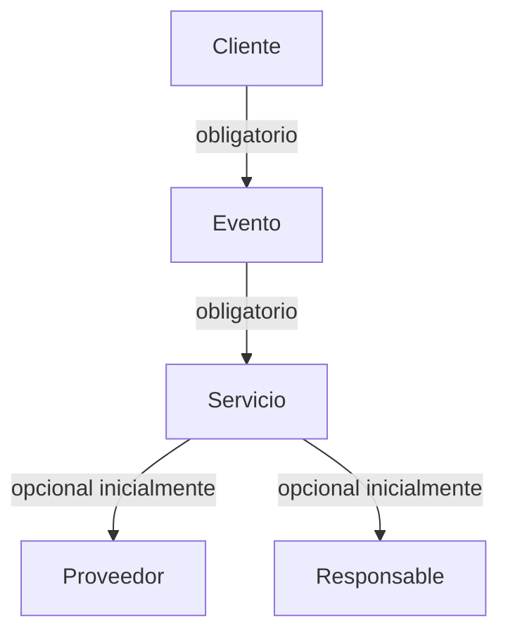
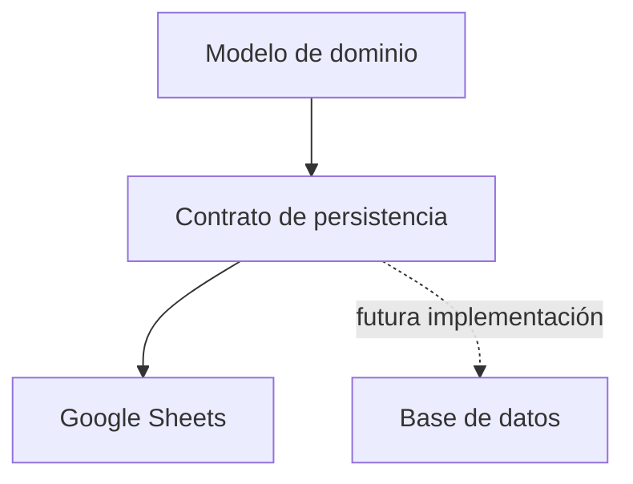

# Modelo de datos del MVP

## 1. Objetivo

Definir el modelo conceptual inicial del dominio para que frontend, backend, persistencia y tests compartan el mismo lenguaje.

Este documento define entidades y relaciones conceptuales. Los nombres definitivos de columnas y la estructura física de Google Sheets se concretarán durante el diseño de persistencia.

## 2. Entidades principales

### Cliente

Persona u organización que contrata o solicita la realización del evento.

Atributos conceptuales iniciales:

- `clienteId`
- `nombre`
- `telefono`
- `email`
- `notas`

### Evento

Ocasión para la cual se requieren uno o más servicios.

Atributos conceptuales iniciales:

- `eventoId`
- `clienteId`
- `nombre`
- `fecha`
- `ubicacion`
- `estado`
- `notas`

### Servicio

Prestación requerida para un evento.

Atributos conceptuales iniciales:

- `servicioId`
- `eventoId`
- `proveedorId`
- `responsableId`
- `tipo`
- `descripcion`
- `fecha`
- `estado`
- `notas`

### Proveedor

Persona u organización que proporciona un servicio.

Atributos conceptuales iniciales:

- `proveedorId`
- `nombre`
- `telefono`
- `email`
- `tipo`
- `notas`

### Responsable

Persona encargada de coordinar o dar seguimiento a un servicio.

Atributos conceptuales iniciales:

- `responsableId`
- `nombre`
- `email`
- `telefono`

## 3. Modelo entidad-relación



## 4. Relaciones

### Cliente → Evento

Un cliente puede tener cero o muchos eventos.

Cada evento pertenece a un cliente.

### Evento → Servicio

Un evento puede requerir cero o muchos servicios.

Cada servicio pertenece a un evento.

### Proveedor → Servicio

Un proveedor puede proporcionar cero o muchos servicios.

Un servicio puede tener cero o un proveedor durante etapas tempranas de su ciclo de vida.

### Responsable → Servicio

Un responsable puede coordinar cero o muchos servicios.

Un servicio puede tener cero o un responsable asignado.

## 5. Identificadores

Cada entidad tendrá un identificador único lógico.



La estrategia concreta para generar IDs queda pendiente. No debe asumirse todavía que serán números consecutivos.

## 6. Estados

### Evento

Se propone inicialmente:

- BORRADOR
- CONFIRMADO
- REALIZADO
- CANCELADO

Estas opciones son provisionales y deberán validarse con el proceso real.

### Servicio

Se propone inicialmente:

- PENDIENTE
- CONFIRMADO
- EN_PROCESO
- FINALIZADO
- CANCELADO

Las transiciones definitivas se especificarán antes de implementar las reglas de negocio.

## 7. Integridad

Reglas conceptuales iniciales:

- No puede existir un evento sin cliente.
- No puede existir un servicio sin evento.
- Un proveedor asociado debe existir.
- Un responsable asociado debe existir.
- Los estados deben pertenecer a catálogos válidos.
- Los identificadores deben ser únicos dentro de su entidad.



## 8. Persistencia inicial en Google Sheets

La implementación inicial puede separar las entidades en hojas independientes:

```text
Google Spreadsheet
│
├── Clientes
├── Eventos
├── Servicios
├── Proveedores
└── Responsables
```

La estructura física deberá documentarse posteriormente. Las hojas no forman parte del contrato que consume el frontend.

## 9. Separación dominio / persistencia



El dominio debe utilizar conceptos como `Evento`, `Servicio` y `Proveedor`, no referencias como `Hoja1!A:F`.

## 10. Auditoría futura

No se incluye como requisito funcional completo del MVP, pero el modelo deberá permitir evolucionar hacia:

- fecha de creación;
- fecha de actualización;
- usuario que realizó el cambio;
- historial de estados.

No se implementará esta capacidad hasta definir su necesidad y alcance.

## 11. Decisiones pendientes

Antes de implementar persistencia definitiva deberán validarse:

- campos obligatorios exactos;
- catálogo de tipos de servicio;
- catálogo de estados de evento;
- catálogo de estados de servicio;
- si un servicio puede tener múltiples proveedores;
- si un servicio puede tener múltiples responsables;
- reglas de fechas;
- estrategia de IDs;
- necesidades de auditoría.

## 12. Regla para Codex

Codex no debe convertir los atributos provisionales de este documento en un contrato definitivo sin validar primero los requisitos correspondientes en `SPEC.md` y `docs/02-requisitos.md`.
