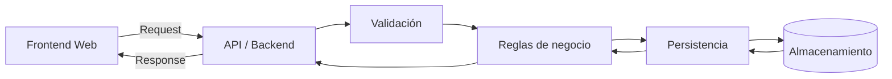
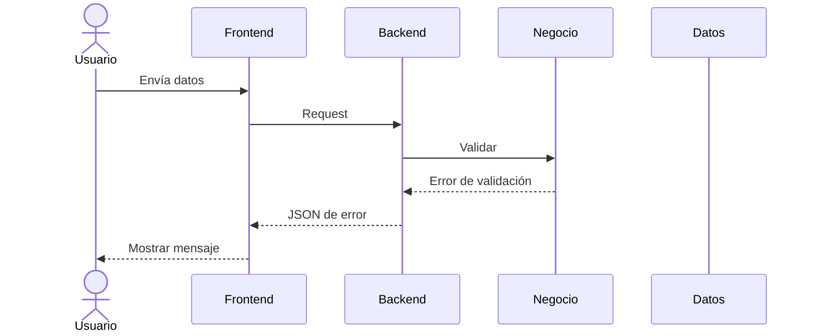
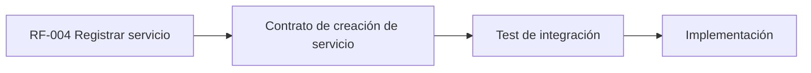

# API del MVP

## 1. Objetivo

Definir el contrato inicial entre el frontend web y el backend.

El contrato describe el comportamiento observable de la API y evita acoplar el frontend a la estructura física del almacenamiento.

La primera implementación utiliza Google Apps Script, pero el contrato conceptual debe poder implementarse con otra tecnología si el proyecto evoluciona.

## 2. Arquitectura de comunicación



## 3. Convenciones

### Métodos

Para el MVP se podrán utilizar:

- `GET` para consultas.
- `POST` para creación.
- `PUT` o `PATCH` para actualización.

La elección definitiva de métodos pertenece al diseño técnico de la implementación y debe documentarse antes de cerrar el contrato.

### Formato

Las solicitudes y respuestas funcionales utilizarán JSON.

### Identificadores

Los recursos se identificarán mediante IDs lógicos definidos en `docs/04-modelo-datos.md`.

## 4. Recursos iniciales

```text
/events
/events/{eventoId}
/events/{eventoId}/services
/services
/services/{servicioId}
/providers
/providers/{proveedorId}
/clients
/clients/{clienteId}
/responsibles
/responsibles/{responsableId}
```

Los nombres anteriores representan el contrato conceptual. La implementación concreta puede adaptar el mecanismo de routing a las capacidades de la plataforma elegida sin cambiar el comportamiento del recurso.

## 5. Crear evento

### Solicitud conceptual

```http
POST /events
Content-Type: application/json
```

```json
{
  "clienteId": "CLI-001",
  "nombre": "Boda familiar",
  "fecha": "2026-10-24",
  "ubicacion": "Ciudad de México",
  "notas": "Evento de ejemplo"
}
```

### Respuesta exitosa conceptual

```json
{
  "success": true,
  "data": {
    "eventoId": "EVT-001",
    "clienteId": "CLI-001",
    "nombre": "Boda familiar",
    "fecha": "2026-10-24",
    "ubicacion": "Ciudad de México",
    "estado": "BORRADOR"
  }
}
```

## 6. Consultar eventos

```http
GET /events
```

Respuesta conceptual:

```json
{
  "success": true,
  "data": [
    {
      "eventoId": "EVT-001",
      "clienteId": "CLI-001",
      "nombre": "Boda familiar",
      "fecha": "2026-10-24",
      "estado": "BORRADOR"
    }
  ]
}
```

## 7. Consultar un evento

```http
GET /events/{eventoId}
```

Debe devolver el evento solicitado o un error `NOT_FOUND`.

## 8. Crear servicio

```http
POST /services
Content-Type: application/json
```

```json
{
  "eventoId": "EVT-001",
  "tipo": "CATERING",
  "descripcion": "Servicio de alimentos",
  "proveedorId": "PROV-001"
}
```

Respuesta conceptual:

```json
{
  "success": true,
  "data": {
    "servicioId": "SRV-001",
    "eventoId": "EVT-001",
    "tipo": "CATERING",
    "descripcion": "Servicio de alimentos",
    "proveedorId": "PROV-001",
    "estado": "PENDIENTE"
  }
}
```

## 9. Consultar servicios de un evento

```http
GET /events/{eventoId}/services
```

Debe devolver solamente los servicios asociados al evento solicitado.

## 10. Actualizar servicio

La operación de actualización se definirá mediante `PUT` o `PATCH` después de establecer las reglas exactas de modificación.

Conceptualmente:

```http
PATCH /services/{servicioId}
Content-Type: application/json
```

```json
{
  "estado": "CONFIRMADO",
  "proveedorId": "PROV-001"
}
```

## 11. Errores

Todas las respuestas de error deberán tener una estructura consistente.

Propuesta:

```json
{
  "success": false,
  "error": {
    "code": "VALIDATION_ERROR",
    "message": "El cliente es obligatorio",
    "details": []
  }
}
```

Códigos conceptuales iniciales:

| Código | Significado |
|---|---|
| `VALIDATION_ERROR` | Datos de entrada inválidos |
| `NOT_FOUND` | Recurso inexistente |
| `INVALID_STATE` | Estado o transición inválida |
| `CONFLICT` | Operación incompatible con el estado actual |
| `INTERNAL_ERROR` | Error inesperado |

## 12. Flujo de error



## 13. Reglas de seguridad

- No exponer secretos en el frontend.
- No almacenar API keys en GitHub.
- Validar nuevamente en backend cualquier dato recibido del cliente.
- No confiar en validaciones realizadas únicamente por JavaScript del navegador.
- Evitar devolver información que el usuario no necesite.

## 14. Idempotencia y duplicados

La estrategia de prevención de duplicados se definirá cuando se conozcan las reglas reales del negocio y el mecanismo definitivo de generación de IDs.

No se implementará una estrategia compleja de idempotencia en el MVP sin un caso de uso que la justifique.

## 15. Tests de API

Los contratos principales deberán tener tests de integración.

Ejemplos:

```text
RF-001 → Crear evento → evento creado
RF-002 → Consultar eventos → lista de eventos
RF-004 → Crear servicio → servicio creado
RF-005 → Consultar servicios → servicios del evento
RF-009 → Cambiar estado → transición válida / inválida
```

El método HTTP y framework de pruebas concretos dependen de la implementación tecnológica.

## 16. Trazabilidad



## 17. Decisiones pendientes

Antes de considerar este contrato definitivo deberán confirmarse:

- mecanismo de routing de la plataforma elegida;
- autenticación y autorización;
- códigos HTTP;
- paginación y filtros;
- formato definitivo de fechas;
- estrategia de IDs;
- límites de tamaño de solicitudes;
- reglas de CORS si fueran necesarias;
- formato final de errores.

## 18. Regla para agentes

No implementar endpoints u operaciones adicionales solamente porque parezcan convenientes. Toda nueva operación debe estar respaldada por un requisito o una decisión documentada.
