# Arquitectura de desarrollo asistido por agentes

## 1. Propósito

Este documento define cómo el proyecto puede ser desarrollado, probado y mantenido por distintos agentes de IA sin depender de un proveedor de LLM concreto ni de un lenguaje de programación concreto.

La aplicación y el sistema de desarrollo asistido por IA son conceptos relacionados pero separados.

> **El repositorio define el producto y sus reglas; el agente ejecuta tareas dentro de esas reglas.**

## 2. Principio de fuente de verdad

La fuente de verdad del proyecto está formada por:

- `SPEC.md`;
- requisitos y criterios de aceptación;
- documentación de `docs/`;
- ADRs aceptados;
- comportamiento especificado;
- tests automatizados.

Las instrucciones específicas de un agente son una capa de adaptación y no deben sustituir esta fuente de verdad.

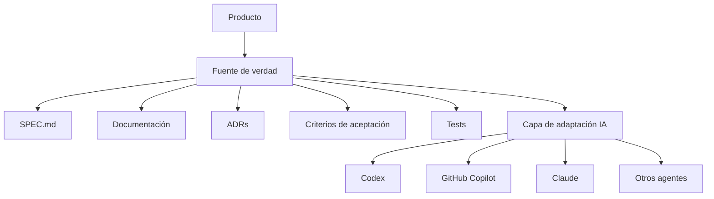

## 3. Mapa de capacidades

| Capacidad | Propósito | Estado para el MVP |
|---|---|---|
| SPEC | Definir qué debe hacer el producto | Activo |
| SKILLS | Instrucciones reutilizables para tareas especializadas | Diseñar / activar según necesidad |
| HARNESS | Controlar contexto, herramientas, ejecución y límites del agente | Diseñar |
| MEMORY | Conservar contexto útil del trabajo sin sustituir la fuente de verdad | Diseñar |
| SEGURIDAD | Controlar secretos, permisos, datos y herramientas | Activo como requisito; ampliar |
| ORQUESTACIÓN | Coordinar tareas o agentes | Diseñar |
| LOOPS | Repetir plan → implementar → probar → corregir hasta cumplir criterios | Activo conceptualmente |
| RAG | Recuperar conocimiento relevante del repositorio o fuentes autorizadas | Futuro / evaluar necesidad |
| TEST UNITARIOS | Verificar comportamiento de unidades de código | Obligatorio |
| DOCUMENTACIÓN | Mantener conocimiento del producto y arquitectura | Activo |
| MCP | Exponer herramientas y fuentes externas al agente con permisos controlados | Diseñar / futuro |
| ADR | Registrar decisiones técnicas importantes | Activo |

## 4. Arquitectura general

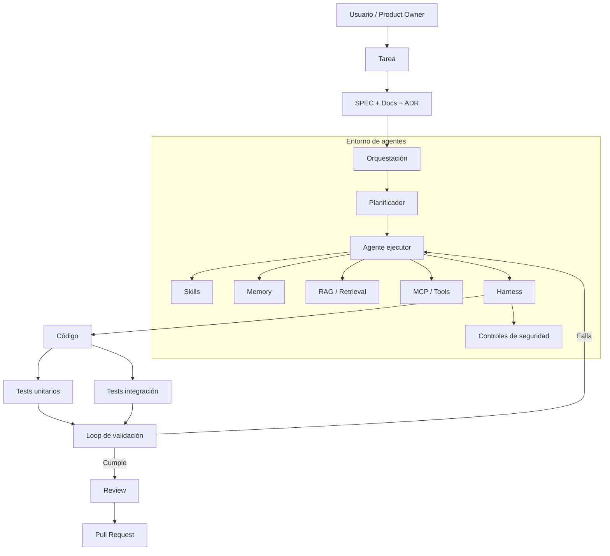

## 5. SPEC

El SPEC define el comportamiento esperado del producto y sirve como entrada principal de las tareas.

Un agente no debe convertir automáticamente una preferencia técnica en requisito funcional.

Ejemplo:

```text
RF-004 — Registrar servicio

Dado un evento existente,
cuando se registra un servicio válido,
entonces el servicio queda asociado al evento.
```

No debe especificarse aquí una clase, framework o lenguaje salvo que exista una decisión arquitectónica que lo requiera.

## 6. SKILLS

Una skill representa conocimiento operativo reutilizable para una clase de tarea.

Ejemplos posibles:

```text
skills/
├── domain-modeling/
├── api-design/
├── unit-testing/
├── security-review/
├── documentation/
└── code-review/
```

Una skill no debe redefinir requisitos del producto. Debe indicar cómo ejecutar correctamente una tarea dentro de los requisitos existentes.

## 7. HARNESS

El harness es la capa de control de la ejecución del agente.

Debe poder establecer, según la herramienta utilizada:

- contexto disponible;
- herramientas autorizadas;
- archivos o áreas modificables;
- comandos permitidos;
- límites de ejecución;
- tests obligatorios;
- condiciones de parada;
- criterios para considerar una tarea terminada.

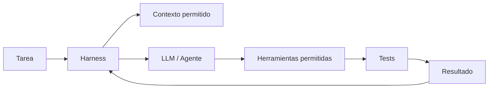

El harness no debe convertirse en una segunda fuente de verdad del producto.

## 8. MEMORY

Memory almacena contexto útil generado durante el trabajo de agentes.

Debe distinguirse de la documentación permanente.

```text
Documentación → conocimiento estable del proyecto
Memory        → contexto acumulado del trabajo
```

La memory no puede invalidar un requisito o ADR aceptado. Cuando exista conflicto, prevalece la fuente de verdad del proyecto.

Posibles categorías futuras:

```text
memory/
├── lessons/
├── failures/
├── context/
└── summaries/
```

## 9. SEGURIDAD

La seguridad es transversal a agentes, código, datos y herramientas.

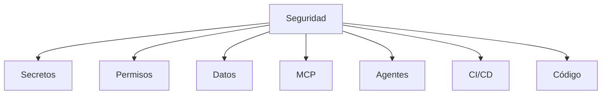

Reglas mínimas:

- nunca colocar secretos en el repositorio;
- limitar permisos de herramientas al mínimo necesario;
- validar entradas en backend;
- no permitir que un agente acceda a recursos no necesarios para su tarea;
- registrar operaciones relevantes cuando el entorno lo permita;
- revisar cambios sensibles antes de incorporarlos a `main`.

## 10. ORQUESTACIÓN

La orquestación coordina tareas, agentes y etapas.

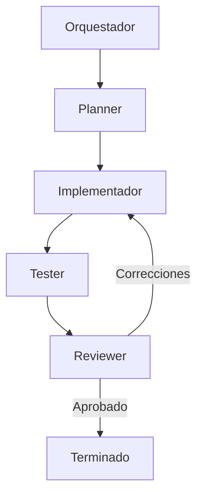

Para el MVP no es obligatorio utilizar múltiples agentes. El diseño debe permitir comenzar con un único agente y evolucionar posteriormente.

## 11. LOOPS

El loop es el mecanismo de retroalimentación que permite al agente corregir su trabajo.

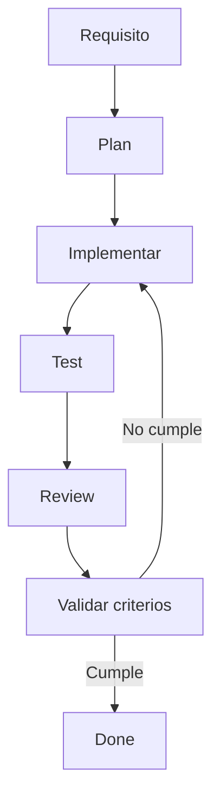

Un loop debe tener condiciones de parada para evitar ejecuciones indefinidas.

## 12. RAG

RAG o retrieval se considera una capacidad futura para recuperar contexto relevante desde:

- documentación;
- ADRs;
- código;
- tests;
- fuentes externas autorizadas.

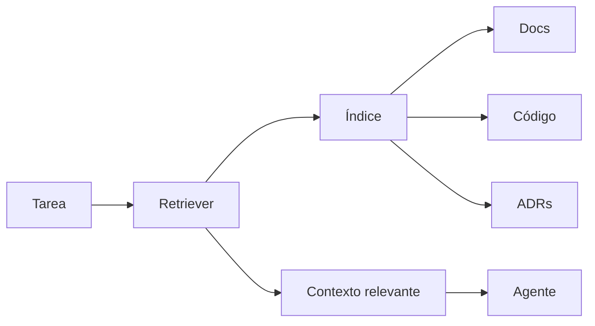

No se implementará un sistema RAG complejo hasta que el tamaño del proyecto o el volumen documental lo justifique.

## 13. TESTS UNITARIOS

Los tests unitarios son una barrera de calidad y una herramienta de feedback para el agente.

La especificación del comportamiento debe ser independiente del framework de testing.

```text
Comportamiento esperado
        ↓
Test unitario
        ↓
Implementación
        ↓
Resultado
```

El framework concreto dependerá del lenguaje elegido.

## 14. DOCUMENTACIÓN

La documentación permanente se mantiene en `docs/` y describe:

- visión;
- requisitos;
- arquitectura;
- modelo de datos;
- API;
- decisiones arquitectónicas;
- arquitectura de agentes.

La documentación debe poder ser utilizada por personas y agentes.

## 15. MCP

MCP se considera una posible capa estandarizada para conectar agentes con herramientas y fuentes externas.

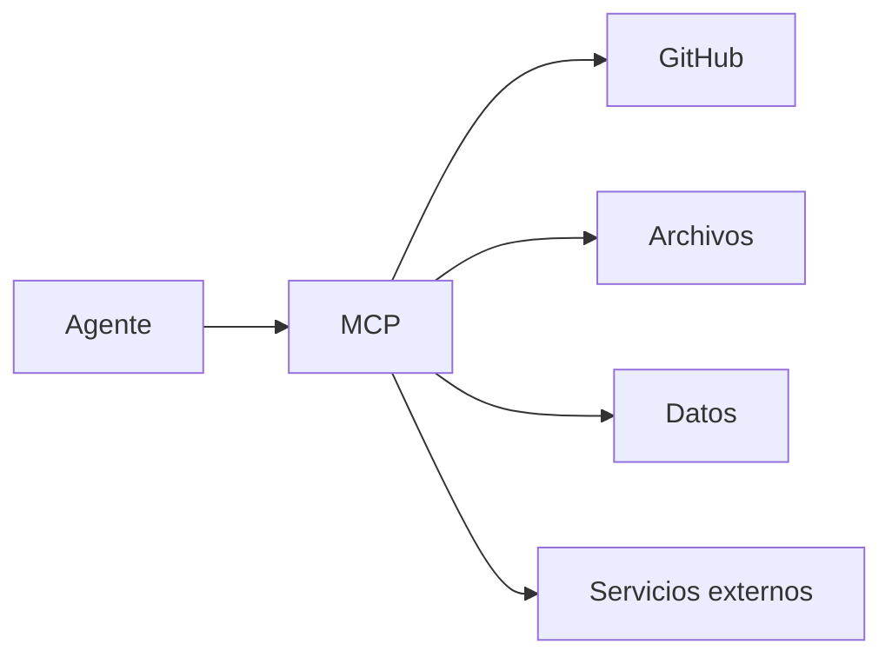

Cada herramienta debe tener permisos explícitos y mínimos. MCP no debe utilizarse para saltarse controles de seguridad.

## 16. ADR

Los ADR registran decisiones técnicas importantes.

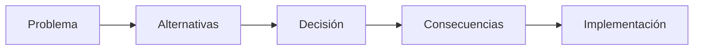

Un agente debe consultar los ADR relevantes antes de modificar una parte arquitectónica del sistema.

## 17. Independencia del lenguaje

La arquitectura funcional debe poder implementarse en distintos lenguajes.

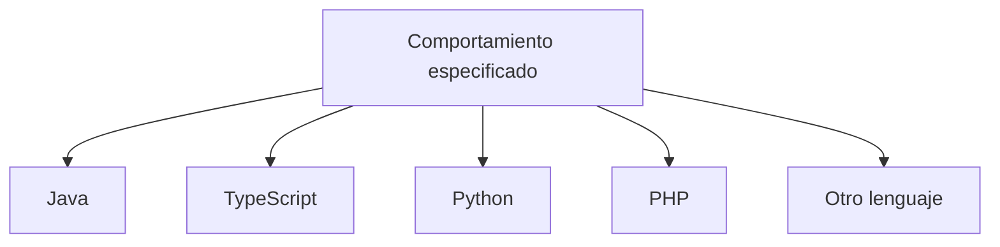

El lenguaje, framework y herramientas de testing pertenecen a la capa de implementación o a decisiones técnicas documentadas.

## 18. Independencia del proveedor de IA

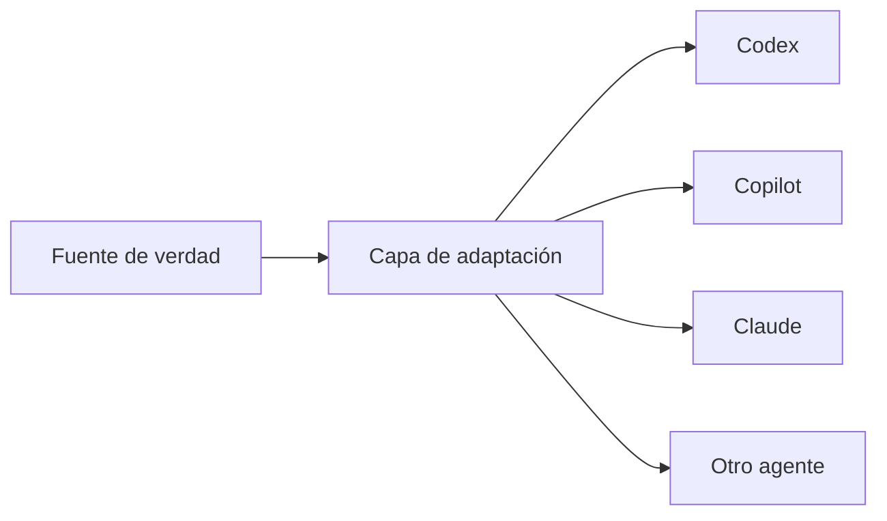

Las instrucciones específicas de cada proveedor deben minimizarse y mantenerse fuera de la definición del producto.

## 19. Flujo estándar de una tarea

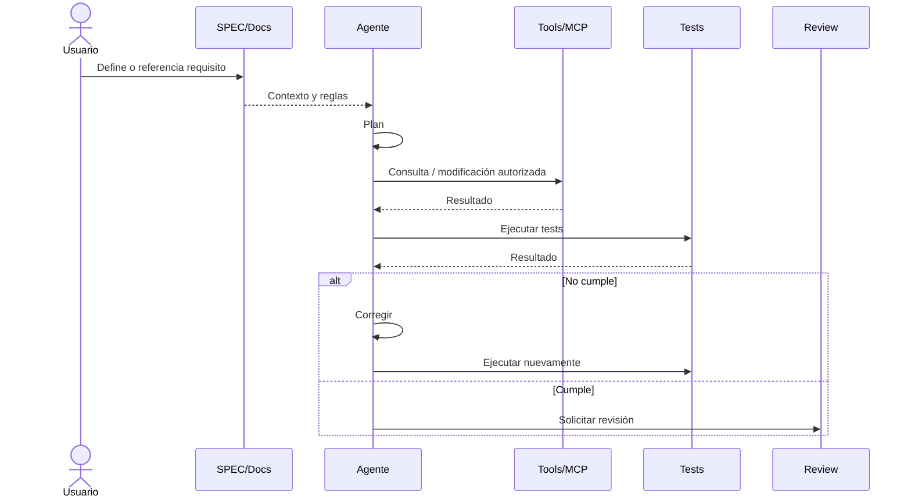

## 20. Definition of Done para agentes

Una tarea no debe considerarse terminada solamente porque el código compila.

Como mínimo debe verificarse:

- requisito identificado;
- alcance respetado;
- tests relevantes creados o actualizados;
- tests ejecutados;
- criterios de aceptación satisfechos;
- documentación actualizada cuando corresponda;
- ADR creado o actualizado si existe una decisión arquitectónica significativa;
- revisión de seguridad cuando el cambio lo requiera;
- cambios limitados al alcance de la tarea.

## 21. Regla de precedencia

Cuando dos fuentes entren en conflicto, aplicar esta prioridad:

```text
1. Requisitos / SPEC
2. ADR aceptados
3. Criterios de aceptación
4. Tests como evidencia del comportamiento esperado
5. Instrucciones generales del proyecto
6. Skills
7. Instrucciones específicas del agente
8. Preferencias del agente
```

Si existe una contradicción real entre requisitos, ADRs o tests, el agente debe detenerse y solicitar resolución en lugar de inventar una decisión.

## 22. Estado de implementación

Este documento describe la arquitectura objetivo. No implica que todas las capacidades estén implementadas en el MVP.

```text
SPEC            → activo
DOCUMENTACIÓN   → activo
ADR             → activo
TEST UNITARIOS  → obligatorio
SKILLS          → gradual
HARNESS         → gradual
MEMORY          → gradual
SEGURIDAD       → gradual y transversal
LOOPS           → gradual
ORQUESTACIÓN    → futuro / según necesidad
RAG             → futuro / según necesidad
MCP             → futuro / según necesidad
```
