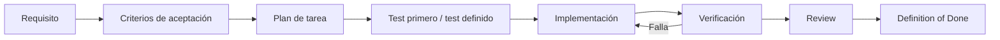
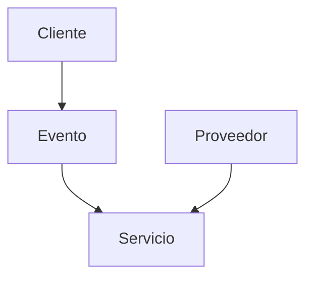
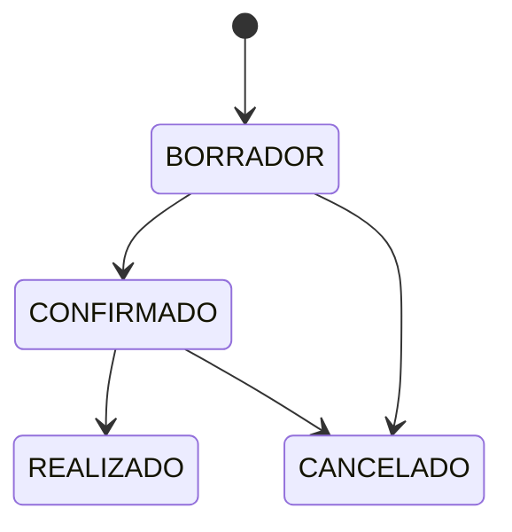
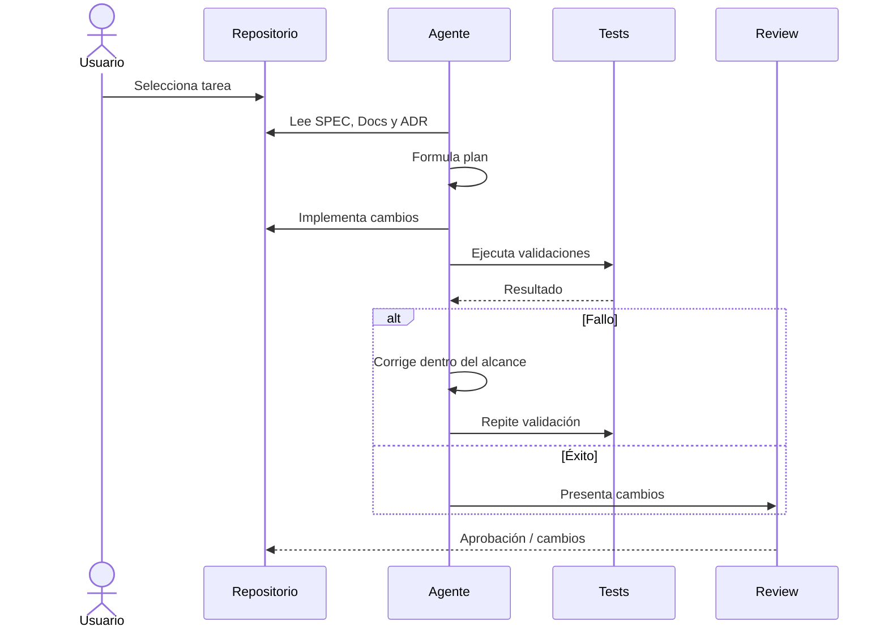
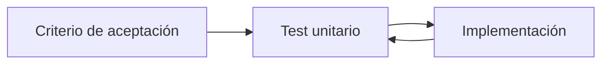
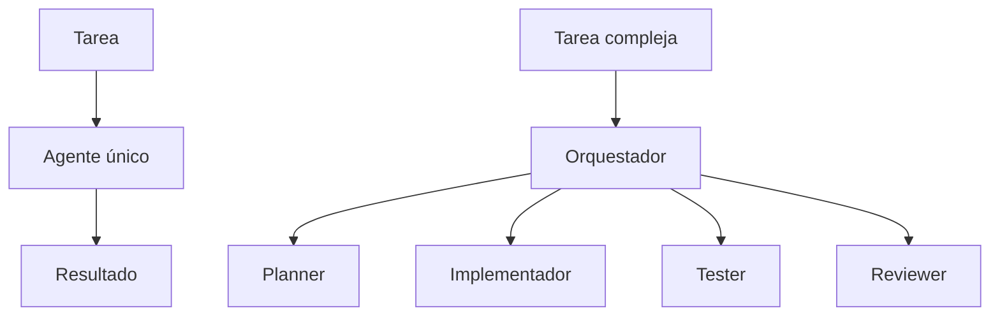

# Plan de implementación del MVP

## 1. Propósito

Convertir la especificación del producto en un conjunto de incrementos pequeños, verificables y ejecutables por una persona o por un agente de IA.

El plan es independiente del proveedor de LLM y del lenguaje de programación.

> **Cada incremento debe poder demostrar que funciona mediante evidencia verificable.**

## 2. Estrategia

El desarrollo seguirá ciclos pequeños:



No se debe construir una gran cantidad de código antes de validar el comportamiento.

## 3. Fases

### MVP-00 — Fundación del proyecto

**Objetivo:** disponer de una base reproducible para desarrollo humano y asistido por agentes.

Incluye:

- estructura del repositorio;
- `SPEC.md`;
- documentación base;
- ADRs;
- reglas para agentes;
- configuración inicial de tests;
- política básica de seguridad;
- CI mínima cuando corresponda.

**Salida:** el proyecto puede ser comprendido y validado por un agente sin depender de conocimiento oculto.

### MVP-01 — Clientes

**Objetivo:** crear y consultar clientes.

Capacidades:

- registrar cliente;
- validar campos obligatorios;
- consultar clientes;
- identificar cliente de forma única.

Criterios mínimos:

- cliente válido se registra;
- datos inválidos se rechazan;
- cliente registrado puede consultarse;
- errores tienen formato consistente.

### MVP-02 — Eventos

**Objetivo:** administrar eventos asociados a clientes.

Capacidades:

- crear evento;
- consultar evento;
- listar eventos;
- asociar evento con cliente;
- gestionar estado inicial.


### MVP-03 — Proveedores

**Objetivo:** administrar proveedores disponibles para los servicios.

Capacidades:

- registrar proveedor;
- consultar proveedor;
- actualizar información básica;
- validar existencia cuando se asocia a un servicio.

### MVP-04 — Servicios

**Objetivo:** registrar servicios requeridos por un evento.

Capacidades:

- crear servicio;
- asociarlo a un evento;
- asociar proveedor cuando corresponda;
- consultar servicios de un evento;
- gestionar estado del servicio.



### MVP-05 — Estados y reglas de negocio

**Objetivo:** hacer explícitas las transiciones permitidas.

Ejemplo conceptual:



Las transiciones definitivas deben derivarse de los requisitos, no de este ejemplo si todavía no han sido aprobadas.

### MVP-06 — API e integración

**Objetivo:** completar la comunicación entre frontend y backend.

Incluye:

- endpoints acordados;
- validación backend;
- formato uniforme de respuestas;
- formato uniforme de errores;
- pruebas de integración;
- protección de secretos.

### MVP-07 — Calidad y seguridad

**Objetivo:** establecer controles antes de considerar el MVP terminado.

Incluye:

- tests unitarios relevantes;
- tests de integración relevantes;
- pruebas de criterios de aceptación;
- revisión de seguridad;
- validación de entradas;
- revisión de secretos;
- CI para validaciones automatizadas.

### MVP-08 — Operación y entrega

**Objetivo:** disponer de una ruta reproducible para validar y desplegar.

Incluye, según necesidad:

- build reproducible;
- despliegue documentado;
- configuración por entorno;
- observabilidad mínima;
- procedimiento de rollback o recuperación.

## 4. Plantilla de tarea

Toda tarea implementable debería poder expresarse así:

```text
ID: TASK-XXX

Requisito:
RF-XXX

Objetivo:
Descripción breve del comportamiento que se desea conseguir.

Contexto:
Documentos y ADR relevantes.

Criterios de aceptación:
- ...
- ...
- ...

Tests:
- unitarios: ...
- integración: ...
- aceptación: ...

Restricciones:
- ...

No hacer:
- ...

Definition of Done:
- [ ] implementación completa
- [ ] tests creados/actualizados
- [ ] tests ejecutados
- [ ] criterios satisfechos
- [ ] documentación actualizada si aplica
- [ ] seguridad revisada si aplica
- [ ] ADR actualizado si aplica
```

## 5. Flujo para agentes



## 6. Uso de Skills

Las skills se aplican según la naturaleza de la tarea.

Ejemplo:

```text
TASK-020 Registrar servicio
        │
        ├── domain-modeling
        ├── api-design
        ├── unit-testing
        └── documentation
```

Una skill no puede modificar silenciosamente los requisitos.

## 7. Uso del Harness

El harness debe ejecutar las tareas bajo límites definidos.

Como mínimo, cuando exista soporte:

```text
1. cargar contexto necesario;
2. limitar herramientas;
3. ejecutar implementación;
4. ejecutar tests;
5. comprobar criterios;
6. detenerse ante errores o ambigüedad.
```

## 8. Loops de validación

Cada loop debe tener:

- objetivo concreto;
- entrada definida;
- validación observable;
- límite de iteraciones o condición de parada;
- resultado final.

No se permite un loop indefinido del tipo "seguir intentando hasta que funcione".

## 9. Tests unitarios

Los tests unitarios se crearán cerca de la implementación correspondiente, siguiendo las convenciones del lenguaje elegido.

El plan funcional no prescribe un framework concreto.



## 10. RAG, Memory y MCP

Estas capacidades no son prerrequisitos para completar la primera funcionalidad del MVP.

Se incorporarán cuando aporten valor verificable:

- **Memory:** cuando el trabajo multi-sesión requiera conservar contexto operativo.
- **RAG:** cuando el volumen de documentación/código haga insuficiente el contexto directo.
- **MCP:** cuando un agente necesite herramientas o fuentes externas con una interfaz controlada.

Cada incorporación deberá tener un objetivo, límites y validación.

## 11. Orquestación

Se comenzará con un único agente cuando sea suficiente.

La multi-orquestación se justificará solamente cuando exista una ventaja clara, por ejemplo separación de responsabilidades entre planificación, implementación y revisión.



## 12. Seguridad como requisito de salida

Una tarea que modifique autenticación, autorización, datos sensibles, herramientas, dependencias o infraestructura debe incluir revisión de seguridad.

Un cambio no se considera terminado por el simple hecho de pasar tests funcionales.

## 13. Definition of Done global

El MVP estará listo cuando:

- los requisitos incluidos en el alcance estén implementados;
- los criterios de aceptación estén satisfechos;
- los tests relevantes pasen;
- no existan secretos en el repositorio;
- las decisiones arquitectónicas relevantes estén documentadas;
- la documentación refleje el estado real;
- exista un proceso reproducible de validación y entrega;
- los cambios puedan ser comprendidos por otro agente sin depender de contexto privado.

## 14. Orden recomendado

```text
MVP-00 Fundación
       ↓
MVP-01 Clientes
       ↓
MVP-02 Eventos
       ↓
MVP-03 Proveedores
       ↓
MVP-04 Servicios
       ↓
MVP-05 Estados
       ↓
MVP-06 API
       ↓
MVP-07 Calidad + Seguridad
       ↓
MVP-08 Entrega
```

La secuencia puede modificarse si un requisito o una decisión arquitectónica lo justifica.

## 15. Regla para cualquier LLM

Antes de modificar código, el agente debe poder responder:

1. ¿Qué requisito estoy implementando?
2. ¿Qué comportamiento se espera?
3. ¿Qué documentos y ADRs aplican?
4. ¿Qué tests demostrarán que funciona?
5. ¿Qué está explícitamente fuera de alcance?
6. ¿Qué condiciones deben cumplirse para considerar terminada la tarea?

Si no puede responder alguna de estas preguntas por falta de información, debe detenerse y solicitar aclaración en lugar de inventarla.
