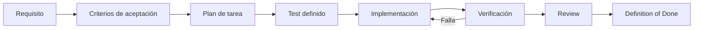
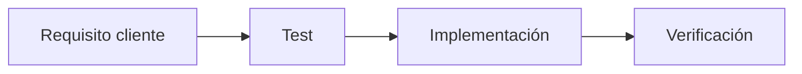
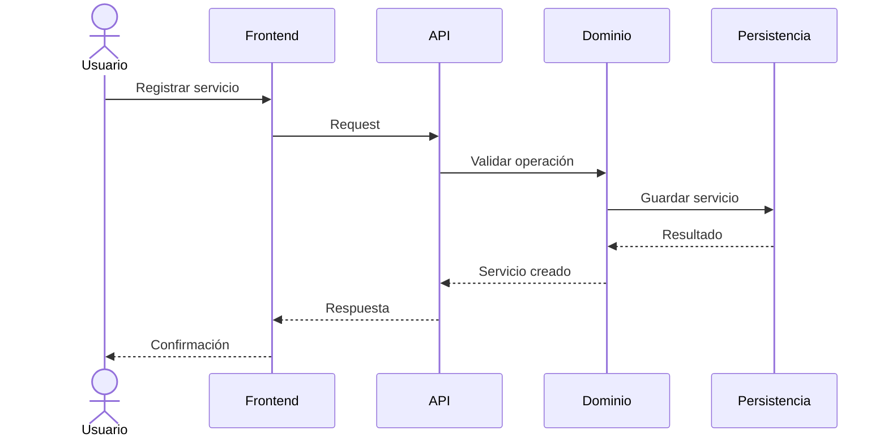
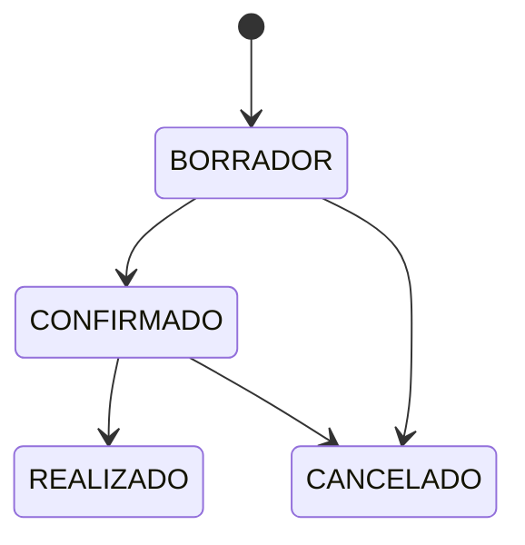
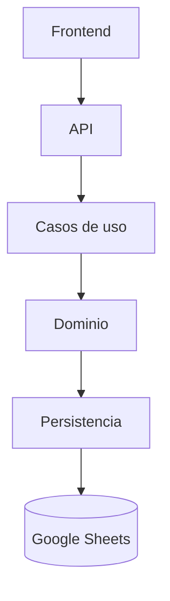
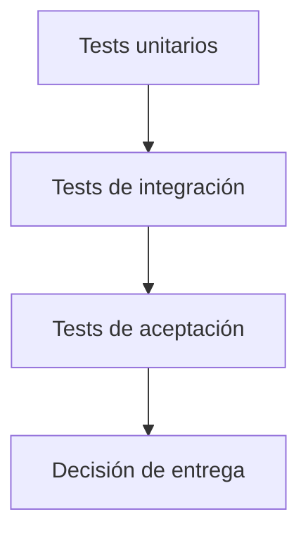
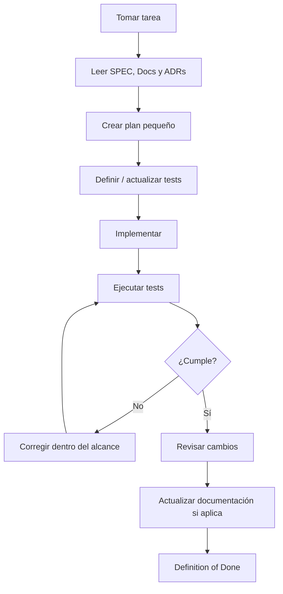
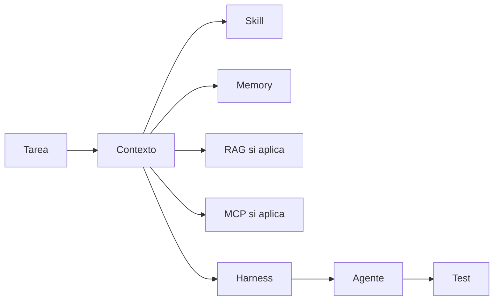
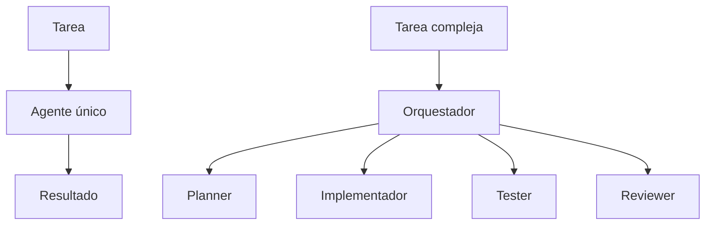

# Plan de implementación del MVP

## 1. Objetivo

Convertir la especificación del producto en incrementos pequeños, verificables y ejecutables por una persona o por un agente de IA.

El plan es independiente del proveedor de LLM y del lenguaje de programación.

> **Cada incremento debe poder demostrar que funciona mediante evidencia verificable.**

## 2. Estrategia de ejecución

Cada incremento sigue este ciclo:

```text
Requisito
   ↓
Criterios de aceptación
   ↓
Plan de tarea
   ↓
Tests
   ↓
Implementación
   ↓
Verificación
   ↓
Review
   ↓
Definition of Done
```



No se debe construir una gran cantidad de código antes de validar el comportamiento.

## 3. Fases

| Fase | Nombre | Objetivo | Estado |
|---|---|---|---|
| MVP-00 | Fundación | Preparar estructura, documentación, calidad y seguridad básica | Siguiente |
| MVP-01 | Clientes | Gestionar clientes | Pendiente |
| MVP-02 | Eventos | Crear y consultar eventos | Pendiente |
| MVP-03 | Proveedores | Gestionar proveedores | Pendiente |
| MVP-04 | Servicios | Registrar y consultar servicios | Pendiente |
| MVP-05 | Estados | Implementar reglas de transición | Pendiente |
| MVP-06 | Integración | Integrar frontend, API y persistencia | Pendiente |
| MVP-07 | Calidad | Tests, seguridad y revisión | Pendiente |
| MVP-08 | Despliegue | Preparar entrega del MVP | Pendiente |

## 4. MVP-00 — Fundación

### Objetivo

Disponer de una base reproducible para desarrollo humano y asistido por agentes.

### Entregables

- estructura del repositorio;
- `SPEC.md`;
- documentación base;
- ADRs;
- reglas para agentes;
- estructura de tests;
- política básica de seguridad;
- CI mínima cuando corresponda;
- README actualizado;
- primer criterio de verificación automatizable.

### Criterios de aceptación

```text
Given el repositorio está preparado
When un agente inicia una tarea
Then puede localizar la fuente de verdad
And puede identificar las reglas relevantes
And conoce cómo ejecutar los tests
And no necesita conocimiento oculto para comenzar.
```

### Definition of Done

- documentación consistente;
- estructura revisada;
- ningún secreto incluido;
- mecanismo de tests identificado;
- cambios revisables mediante Git.

## 5. MVP-01 — Clientes

### Objetivo

Permitir registrar y consultar clientes.

### Comportamiento mínimo

- crear cliente;
- consultar clientes;
- consultar cliente por identificador;
- validar campos obligatorios.

### Tests mínimos

- creación válida;
- datos obligatorios ausentes;
- identificador único;
- consulta de cliente inexistente.



## 6. MVP-02 — Eventos

### Objetivo

Permitir crear y consultar eventos asociados a un cliente.

### Comportamiento mínimo

- crear evento;
- consultar eventos;
- consultar evento por identificador;
- impedir evento sin cliente válido;
- manejar estado inicial.

### Tests mínimos

- creación válida;
- cliente inexistente;
- campos obligatorios;
- consulta inexistente;
- estado inicial correcto.

## 7. MVP-03 — Proveedores

### Objetivo

Permitir registrar y consultar proveedores.

### Tests mínimos

- creación válida;
- validación;
- consulta;
- identificador único.

## 8. MVP-04 — Servicios

### Objetivo

Permitir asociar servicios a eventos y, cuando corresponda, a proveedores.

### Comportamiento mínimo

- crear servicio;
- consultar servicios de un evento;
- consultar servicio por identificador;
- validar evento existente;
- validar proveedor cuando se proporcione;
- asignar estado inicial.



## 9. MVP-05 — Estados

### Objetivo

Aplicar las reglas de ciclo de vida de eventos y servicios.

### Regla

No basta con validar que un estado exista. Debe validarse que la transición sea permitida.



El diagrama es provisional y deberá ajustarse a las reglas de negocio definitivas.

### Tests

- transición válida;
- transición inválida;
- cancelación válida;
- estado desconocido;
- persistencia del nuevo estado.

## 10. MVP-06 — Integración

### Objetivo

Conectar las capas sin romper sus límites.



### Verificaciones

- contratos API;
- validación backend;
- persistencia;
- manejo de errores;
- flujo completo de casos principales.

## 11. MVP-07 — Calidad y seguridad

### Objetivo

Comprobar que el MVP sea mantenible y seguro antes de su entrega.

### Actividades

- tests unitarios;
- tests de integración;
- tests de aceptación de los flujos críticos;
- revisión de seguridad;
- validación de entradas;
- revisión de secretos;
- CI para validaciones automatizadas;
- revisión de dependencias.



## 12. MVP-08 — Despliegue

### Objetivo

Preparar una versión reproducible del MVP.

### Verificaciones

- configuración separada de código;
- secretos fuera del repositorio;
- instrucciones de despliegue;
- versión identificable;
- pruebas posteriores al despliegue;
- procedimiento de recuperación o rollback cuando aplique.

## 13. Formato estándar de una tarea

Toda tarea implementable debe poder documentarse así:

```text
ID: TASK-XXX

Requisito:
RF-XXX

Objetivo:
Descripción breve del comportamiento que se desea conseguir.

Contexto:
Documentos y ADR relevantes.

Criterios de aceptación:
Given / When / Then

Tests:
- unitarios: ...
- integración: ...
- aceptación: ...

Restricciones:
- ...

No hacer:
- ...

Definition of Done:
- [ ] implementación completa
- [ ] tests creados/actualizados
- [ ] tests ejecutados
- [ ] criterios satisfechos
- [ ] documentación actualizada si aplica
- [ ] seguridad revisada si aplica
- [ ] ADR actualizado si aplica
```

## 14. Flujo para agentes



## 15. Límites de autonomía

Un agente puede realizar cambios de implementación dentro del alcance de una tarea cuando:

- el requisito está claro;
- las decisiones necesarias están documentadas;
- los tests son suficientes;
- no se modifican controles de seguridad sin revisión.

Debe detenerse y solicitar decisión cuando:

- hay conflicto entre requisitos;
- debe cambiar una decisión arquitectónica aceptada;
- necesita introducir una tecnología con impacto significativo;
- debe modificar autenticación, autorización o manejo de secretos de forma sustancial;
- los criterios de aceptación son ambiguos.

## 16. Uso de Skills, Harness, Memory, RAG y MCP

Estas capacidades son facilitadores del proceso y no sustituyen la fuente de verdad.



El MVP comienza con las capacidades mínimas necesarias. Las capacidades avanzadas se incorporarán cuando exista una necesidad concreta.

## 17. Orquestación

Se comenzará con un único agente cuando sea suficiente.

La multi-orquestación se justificará solamente cuando exista una ventaja clara, por ejemplo separación de responsabilidades entre planificación, implementación y revisión.



## 18. Seguridad como requisito de salida

Una tarea que modifique autenticación, autorización, datos sensibles, herramientas, dependencias o infraestructura debe incluir revisión de seguridad.

Un cambio no se considera terminado por el simple hecho de pasar tests funcionales.

## 19. Definition of Done global

El MVP estará listo cuando:

- los requisitos incluidos en el alcance estén implementados;
- los criterios de aceptación estén satisfechos;
- los tests relevantes pasen;
- no existan secretos en el repositorio;
- las decisiones arquitectónicas relevantes estén documentadas;
- la documentación refleje el estado real;
- exista un proceso reproducible de validación y entrega;
- los cambios puedan ser comprendidos por otro agente sin depender de contexto privado.

## 20. Orden recomendado

```text
MVP-00 Fundación
       ↓
MVP-01 Clientes
       ↓
MVP-02 Eventos
       ↓
MVP-03 Proveedores
       ↓
MVP-04 Servicios
       ↓
MVP-05 Estados
       ↓
MVP-06 Integración
       ↓
MVP-07 Calidad + Seguridad
       ↓
MVP-08 Entrega
```

La secuencia puede modificarse si un requisito o una decisión arquitectónica lo justifica.

## 21. Regla para cualquier LLM

Antes de modificar código, el agente debe poder responder:

1. ¿Qué requisito estoy implementando?
2. ¿Qué comportamiento se espera?
3. ¿Qué documentos y ADRs aplican?
4. ¿Qué tests demostrarán que funciona?
5. ¿Qué está explícitamente fuera de alcance?
6. ¿Qué condiciones deben cumplirse para considerar terminada la tarea?

Si no puede responder alguna de estas preguntas por falta de información, debe detenerse y solicitar aclaración en lugar de inventarla.
