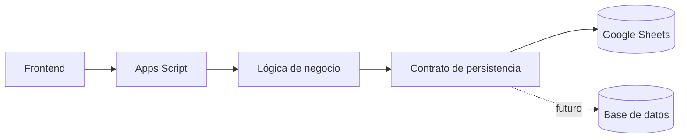

# ADR-001 — Persistencia inicial del MVP

## Estado

Aceptado

## Contexto

El MVP necesita un mecanismo de persistencia sencillo que permita validar rápidamente el producto y aprovechar la infraestructura con la que ya se cuenta.

## Decisión

La persistencia inicial del MVP utilizará **Google Sheets**, accedida mediante el backend de **Google Apps Script**.

Esta decisión aplica al MVP y no constituye una decisión permanente sobre la base de datos del producto.

## Alternativas consideradas

- Base de datos relacional desde el inicio.
- Supabase.
- Firebase.
- Cloudflare D1.
- Google Sheets.

Para esta etapa se prioriza simplicidad de puesta en marcha y velocidad de validación.

## Consecuencias

### Positivas

- Menor infraestructura inicial.
- Fácil inspección manual de los datos durante el MVP.
- Reutilización de herramientas conocidas.
- Menor tiempo para validar el producto.

### Negativas

- Limitaciones de concurrencia y escalabilidad.
- Menor capacidad que una base de datos dedicada.
- Necesidad de aislar el acceso a Sheets para facilitar una futura migración.

## Reversibilidad

Alta. La arquitectura exige que la lógica de negocio no dependa directamente de las hojas.

## Impacto en agentes

Los agentes no deben:

- acceder a Google Sheets directamente desde el frontend;
- colocar referencias a celdas dentro de la lógica de negocio;
- asumir que Google Sheets será la persistencia definitiva;
- migrar a otra base de datos sin una nueva decisión documentada.

