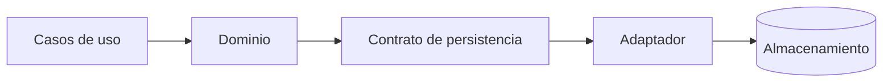

# ADR-002 — Separación entre dominio y persistencia

## Estado

Aceptado

## Contexto

El MVP utilizará Google Sheets, pero el producto puede evolucionar posteriormente hacia una base de datos dedicada. Acoplar las reglas del negocio al almacenamiento dificultaría esa evolución y limitaría la posibilidad de probar el dominio de forma aislada.

## Decisión

La lógica de negocio se diseñará independientemente del mecanismo físico de persistencia.

El acceso a datos deberá pasar por contratos o interfaces conceptuales de persistencia.

## Alternativas consideradas

1. Acceso directo a Google Sheets desde cada operación.
2. Encapsular Google Sheets detrás de una capa de persistencia.
3. Construir desde el inicio una abstracción excesivamente compleja para múltiples bases de datos.

Se elige la segunda opción, manteniendo la abstracción simple.

## Consecuencias

- El dominio será más fácil de probar.
- La persistencia podrá cambiar con menor impacto.
- Habrá una pequeña capa adicional de código.
- No se diseñarán abstracciones para escenarios futuros que todavía no estén justificados.

## Reversibilidad

Alta. La decisión puede evolucionar cuando cambien las necesidades del producto.

## Impacto en agentes

Un agente debe mantener separadas estas responsabilidades:

El agente no debe introducir dependencias directas del almacenamiento en reglas de negocio solamente para simplificar una implementación puntual.
