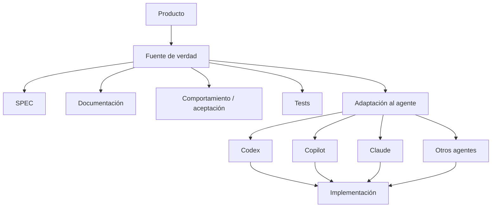

# ADR-003 — Arquitectura de desarrollo LLM-agnóstica

## Estado

Aceptado

## Contexto

El proyecto puede utilizar distintos asistentes o agentes de IA, por ejemplo Codex, GitHub Copilot, Claude u otros. También puede evolucionar entre distintos lenguajes y frameworks.

Si los requisitos y reglas del producto dependieran de un proveedor de IA o de un lenguaje concreto, el conocimiento del proyecto quedaría acoplado a una herramienta.

## Decisión

La fuente de verdad del proyecto será independiente del proveedor de LLM y del lenguaje de programación.

Las reglas del producto vivirán principalmente en:

- `SPEC.md`;
- `docs/`;
- `docs/decisions/`;
- criterios de aceptación;
- especificaciones de comportamiento;
- tests.

Las instrucciones específicas para agentes serán una capa de adaptación, no la definición del producto.

## Alternativas consideradas

### A. Acoplar todo a un único agente

Descartado porque limita la portabilidad del proyecto.

### B. Escribir requisitos directamente en términos del lenguaje

Descartado porque mezcla comportamiento de negocio con detalles de implementación.

### C. Mantener una especificación neutral y adaptadores por herramienta

Seleccionado porque conserva el conocimiento del producto independientemente de la herramienta utilizada.

## Consecuencias

### Positivas

- Posibilidad de cambiar de LLM.
- Posibilidad de cambiar de lenguaje.
- Mayor vida útil de la documentación.
- Menor dependencia de un proveedor.
- Mejor trazabilidad entre negocio, tests e implementación.

### Negativas

- Será necesario mantener pequeñas instrucciones/adaptadores para herramientas concretas.
- Algunas capacidades específicas de cada agente no podrán expresarse de forma totalmente universal.

## Reversibilidad

Alta. Los adaptadores pueden cambiar sin modificar el dominio.

## Impacto en agentes

Un agente debe:

1. consultar la fuente de verdad antes de implementar;
2. distinguir requisitos de decisiones técnicas;
3. respetar ADRs aceptados;
4. no inventar requisitos;
5. expresar las decisiones específicas de la herramienta solamente en su capa de adaptación;
6. mantener los tests como validación del comportamiento.

## Regla fundamental

> **El LLM implementa el proyecto; no define unilateralmente el proyecto.**
