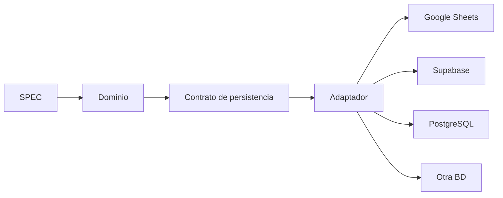
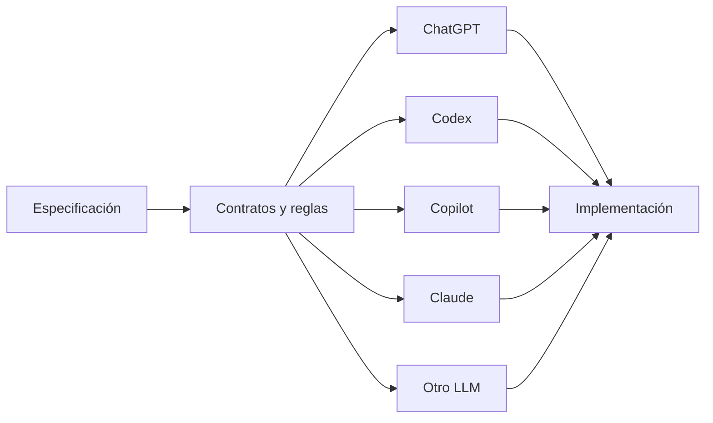

# ADR-004 — Stack tecnológico del MVP

## Estado

Aceptado

## Contexto

El proyecto necesita una base tecnológica para implementar el MVP, pero uno de sus objetivos arquitectónicos es permanecer **LLM-agnóstico** y, en las capas de producto, contrato y documentación, **lo más independiente posible del lenguaje**.

El `SPEC.md` define comportamiento y alcance, no clases, funciones, frameworks ni lenguajes. Por tanto, convertir un lenguaje concreto en una decisión del dominio reduciría la portabilidad del proyecto sin aportar valor funcional.

## Decisión

Se adopta una estrategia de **arquitectura y contratos agnósticos al lenguaje**, mientras que el lenguaje, framework y runtime quedan confinados a la capa de implementación.

La decisión se divide en dos niveles:

1. **Producto y arquitectura:** deben permanecer independientes del lenguaje y del proveedor de LLM.
2. **Implementación:** podrá utilizar Java, TypeScript, Python u otro lenguaje que cumpla los contratos, tests, seguridad y restricciones del proyecto.

La selección del lenguaje/framework concreto no forma parte de este ADR. Se documentará mediante un ADR específico de implementación cuando sea necesario para comenzar el código.

## Criterios obligatorios para cualquier implementación

Cualquier stack seleccionado deberá permitir, como mínimo:

- implementar el comportamiento definido por `SPEC.md`;
- mantener contratos de dominio y API verificables;
- ejecutar tests automatizados apropiados;
- aplicar controles de seguridad;
- separar dominio de infraestructura cuando corresponda;
- permitir reemplazar la persistencia mediante adaptadores/puertos cuando aplique;
- integrarse con CI;
- ser mantenible por humanos y distintos agentes de IA;
- evitar que decisiones específicas del LLM se conviertan en requisitos del producto.

## Alternativas consideradas

### Google Apps Script + JavaScript

Adecuado cuando la prioridad sea aprovechar directamente Google Sheets y minimizar infraestructura inicial. No se adopta como requisito arquitectónico porque limitaría la portabilidad.

### TypeScript

Candidato fuerte para una implementación web por tipado, ecosistema y testing. Podrá seleccionarse posteriormente mediante un ADR de implementación.

### Java + Spring

Candidato fuerte cuando se prioricen ecosistema empresarial, tipado, testing y experiencia existente. Podrá seleccionarse posteriormente mediante un ADR de implementación.

### Python

Candidato viable por rapidez y ecosistema. Podrá seleccionarse posteriormente mediante un ADR de implementación.

## Consecuencias positivas

- El `SPEC.md` no necesita cambiar al cambiar de lenguaje.
- Diferentes equipos o agentes pueden implementar el mismo comportamiento.
- La migración tecnológica queda localizada en la capa de implementación.
- Se reduce el acoplamiento con un LLM, IDE o herramienta concreta.
- Las decisiones de tecnología quedan trazables mediante ADRs independientes.

## Consecuencias negativas

- Se requiere disciplina para no introducir detalles tecnológicos en documentos agnósticos.
- Habrá que definir contratos suficientemente precisos para que distintas implementaciones sean equivalentes.
- Mantener más de una implementación real podría incrementar el costo si alguna vez se decide hacerlo.

## Relación con la persistencia

El mismo principio se aplica a la base de datos:

Cambiar la base de datos no debe obligar a reescribir la especificación funcional.

## Relación con los LLM

La elección del agente y la elección del lenguaje son dimensiones independientes.

## Próxima decisión requerida

Antes de escribir código de producción deberá crearse un ADR de **stack de implementación** que seleccione lenguaje, framework/runtime y herramientas concretas, tomando como entrada este ADR y los requisitos reales del MVP.

Ese ADR no podrá modificar el comportamiento definido por `SPEC.md` sin actualizar primero la especificación correspondiente.

## Reversibilidad

Alta a nivel arquitectónico y documental. La implementación concreta puede tener un costo de migración, pero no debe contaminar las capas agnósticas.

## Impacto en agentes

Un agente no debe asumir un lenguaje concreto al interpretar `SPEC.md` o la documentación funcional. Para modificar código deberá consultar el ADR de implementación vigente y respetar sus restricciones.
