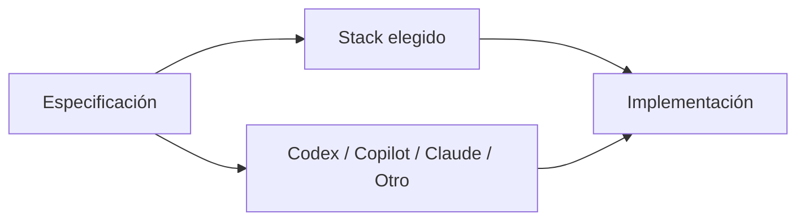

# ADR-004 — Stack tecnológico del MVP

## Estado

Propuesto

## Contexto

El proyecto necesita seleccionar un stack inicial para implementar el MVP. La selección debe considerar la velocidad de validación, la infraestructura existente, testing, seguridad, mantenibilidad y la capacidad de trabajar con distintos agentes de IA.

La arquitectura funcional y la documentación deben permanecer independientes del lenguaje y del proveedor de LLM.

## Criterios de evaluación

- velocidad de desarrollo del MVP;
- simplicidad operativa;
- compatibilidad con la arquitectura actual;
- facilidad de testing;
- seguridad;
- mantenibilidad;
- costo;
- facilidad de despliegue;
- facilidad de migración futura;
- compatibilidad con desarrollo asistido por agentes.

## Alternativas

### A. Google Apps Script + JavaScript

Ventajas: mínima infraestructura adicional y compatibilidad directa con Google Sheets.

Desventajas: mayores límites de plataforma y menor portabilidad para una evolución hacia infraestructura convencional.

### B. TypeScript

Ventajas: tipado estático, buen ecosistema web y buena mantenibilidad.

Desventajas: requiere definir infraestructura de ejecución y persistencia adicional si se abandona Apps Script.

### C. Java + Spring

Ventajas: ecosistema maduro, fuerte tipado, testing y experiencia empresarial.

Desventajas: mayor complejidad inicial y mayor esfuerzo operativo para un MVP pequeño.

### D. Python

Ventajas: rapidez de desarrollo y amplio ecosistema.

Desventajas: requiere seleccionar framework e infraestructura y no ofrece una ventaja clara sobre las opciones anteriores para este MVP sin más requisitos.

## Decisión

**Pendiente de confirmación.**

No se seleccionará un stack definitivo hasta revisar los requisitos del MVP y decidir si la prioridad principal es aprovechar la infraestructura existente o construir desde el inicio una base más portable.

## Consecuencias

Hasta que este ADR pase a estado `Aceptado`, los documentos de requisitos y arquitectura no deben asumir un lenguaje o framework concreto.

Una vez aceptado:

1. el stack elegido se documentará aquí;
2. las decisiones de implementación derivadas deberán respetarlo;
3. los frameworks de testing se documentarán en la capa de implementación;
4. una futura migración de stack requerirá un nuevo ADR que reemplace o modifique esta decisión.

## Relación con la arquitectura LLM-agnóstica

El stack tecnológico no define el agente utilizado.

El mismo requisito debe poder ser interpretado por diferentes agentes. La elección de agente y la elección de lenguaje son dimensiones independientes.

## Reversibilidad

Media. Cambiar el stack después de comenzar la implementación puede tener un coste significativo, por lo que la decisión debe tomarse antes de desarrollar funcionalidades sustanciales.

## Impacto en agentes

Hasta que el ADR sea aceptado, un agente no debe asumir Java, TypeScript, Python u otro lenguaje como requisito del producto.

Después de su aceptación, el agente deberá respetar el stack establecido y consultar los ADR relacionados antes de introducir cambios tecnológicos importantes.
