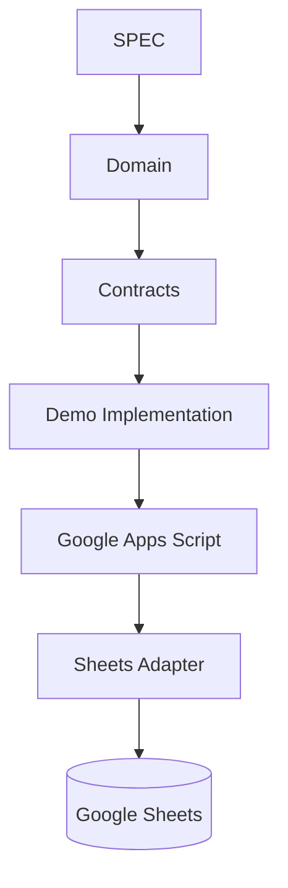
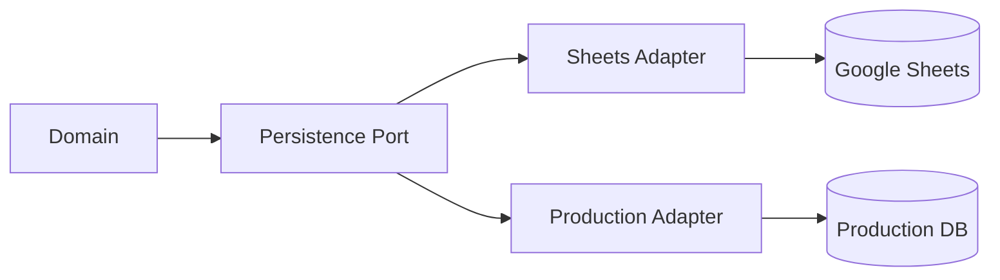

# ADR-005 — Stack de implementación del MVP

## Estado

**Aceptado para la fase de Demo**

## Contexto

ADR-004 establece que el producto, la arquitectura conceptual y los contratos deben permanecer independientes del lenguaje y del proveedor de LLM. La restricción operativa actual es que la demo debe poder ejecutarse sin requerir instalaciones locales en la laptop.

Por ello se separan explícitamente dos decisiones:

1. **Implementación Demo:** Google Apps Script + Google Sheets.
2. **Implementación objetivo de producción:** se decidirá posteriormente mediante un ADR específico cuando existan requisitos de despliegue y operación suficientes.

La implementación Demo no modifica el dominio, los contratos ni la arquitectura conceptual.

## Decisión

Para **VS-001 y la primera demostración funcional** se utilizará:

| Capa | Tecnología |
|---|---|
| Cliente | Navegador web |
| Frontend | HTML/CSS/JavaScript servido desde Apps Script |
| API | Google Apps Script Web App |
| Aplicación | Casos de uso implementados en Apps Script |
| Dominio | JavaScript/ECMAScript, manteniendo separación conceptual |
| Persistencia | Google Sheets mediante adaptador |
| Testing | Casos funcionales definidos en `docs/testing/`; automatización posterior según capacidad del entorno |
| Repositorio | GitHub |
| Documentación | Markdown + Mermaid |

### Restricción de diseño

Google Sheets y Apps Script son **adaptadores/infraestructura de la Demo**, no la fuente de verdad del producto.

## Por qué esta decisión

La prioridad inmediata es obtener una demo verificable con el menor bloqueo operativo posible.

La alternativa permite:

- trabajar desde el navegador;
- evitar instalaciones locales de Java, Node.js, Docker o PostgreSQL;
- aprovechar el entorno Google ya conocido;
- demostrar VS-001 de extremo a extremo;
- mantener los contratos independientes;
- preparar una futura sustitución de persistencia.

## Qué NO se está decidiendo

Este ADR no establece que la aplicación de producción deba utilizar:

- Google Sheets;
- Google Apps Script;
- JavaScript;
- TypeScript;
- Java/Spring;
- PostgreSQL;
- Supabase.

Esas decisiones se tomarán cuando corresponda.

## Evolución prevista

Una futura implementación puede ser TypeScript/Node, Java/Spring u otro lenguaje, siempre que satisfaga los contratos y casos de prueba.

## Relación con los LLM

La implementación deberá poder ser trabajada por distintos LLM o herramientas, incluyendo Codex, Copilot, Claude u otros, sin introducir instrucciones específicas del proveedor en el dominio.

Los agentes deberán utilizar el repositorio como fuente de contexto, especialmente:

- `PROJECT.md`;
- `SPEC.md`;
- `AGENTS.md`;
- ADRs aplicables;
- vertical slices;
- contratos;
- casos de prueba.

## Seguridad

- No se almacenarán secretos en GitHub.
- El navegador no tendrá acceso directo de escritura a las hojas.
- Las validaciones se ejecutarán en el lado servidor de la Demo.
- La configuración de acceso se manejará fuera del código público.
- Los datos de demostración estarán separados de datos reales.

## Consecuencias

### Positivas

- Demo accesible sin instalaciones locales.
- Menor fricción para validar el producto.
- Aprovecha herramientas conocidas.
- Mantiene abierta la migración tecnológica.
- Permite validar primero comportamiento y UX.

### Negativas

- Apps Script y Sheets tienen limitaciones frente a una plataforma backend/BD dedicada.
- La automatización de tests será más limitada que en un stack local completo.
- Algunas capacidades de producción deberán rediseñarse posteriormente.

## Criterio para reconsiderar

Se deberá abrir un nuevo ADR de stack de producción cuando aparezca cualquiera de estas necesidades:

- múltiples usuarios concurrentes de forma significativa;
- transacciones reales;
- requisitos avanzados de seguridad;
- integración con servicios externos;
- escalabilidad;
- despliegue profesional;
- observabilidad;
- necesidades de rendimiento que excedan la Demo.

## Estado de implementación

**No se ha creado código de aplicación todavía.**

El siguiente paso, una vez aprobada la estrategia, es implementar únicamente el mínimo necesario para ejecutar VS-001 como Demo sin instalación.
