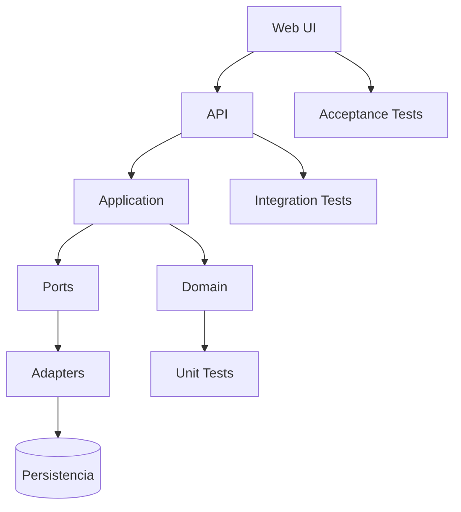

# ADR-005 — Stack de implementación del MVP

## Estado

Propuesto

## Contexto

ADR-004 establece que el producto, la arquitectura conceptual y los contratos deben permanecer independientes del lenguaje y del proveedor de LLM. Antes de crear código ejecutable necesitamos seleccionar una implementación concreta.

El MVP es una aplicación web para administrar eventos sociales y debe demostrar un vertical slice completo: interfaz web, API/contrato, aplicación, dominio, persistencia, validación, tests, seguridad básica y CI.

## Criterios de evaluación

| Criterio | Importancia |
|---|---|
| Adecuación para aplicación web | Alta |
| Testing automatizado | Alta |
| Tipado y mantenibilidad | Alta |
| Facilidad para agentes LLM | Alta |
| Separación dominio/infraestructura | Alta |
| CI/CD | Alta |
| Ecosistema y documentación | Alta |
| Complejidad operativa para MVP | Media |
| Experiencia disponible en el proyecto | Media |

## Alternativas

### TypeScript

Ventajas: ecosistema web muy amplio, tipado estático, facilidad para compartir contratos con frontend/backend, buena disponibilidad de herramientas de testing y alta compatibilidad con flujos de desarrollo asistidos por LLM.

Riesgos: el ecosistema ofrece muchas alternativas de framework y librerías, por lo que será necesario limitar decisiones y dependencias.

### Java + Spring

Ventajas: tipado fuerte, ecosistema empresarial maduro, testing sólido, separación clara de capas y buena adecuación para una API mantenible.

Riesgos: mayor volumen de configuración y complejidad inicial para un MVP web pequeño.

### Python

Ventajas: velocidad de desarrollo y ecosistema amplio.

Riesgos: requiere disciplina adicional para mantener contratos y tipos consistentes a medida que crezca el sistema.

### Google Apps Script

Ventajas: integración directa con Google Sheets y baja infraestructura inicial.

Riesgos: menor portabilidad y mayor acoplamiento con el ecosistema Google, contrario al objetivo de mantener la implementación sustituible.

## Evaluación preliminar

Para este MVP, **TypeScript** resulta la opción preliminarmente más equilibrada por su cercanía al frontend web, tipado, testing, ecosistema y facilidad de trabajo con distintos agentes LLM.

Sin embargo, la decisión definitiva requiere fijar también framework/runtime y estrategia de persistencia. Por ello este ADR queda inicialmente en estado **Propuesto** y no autoriza todavía la creación de código.

## Arquitectura objetivo de implementación

## Restricciones

La implementación seleccionada deberá:

- respetar `SPEC.md`;
- respetar los criterios de aceptación de los vertical slices;
- mantener el dominio aislado de detalles de persistencia cuando corresponda;
- permitir sustituir la base de datos mediante adaptadores;
- ejecutar tests automáticamente;
- integrarse con GitHub Actions;
- no introducir secretos en el repositorio;
- ser comprensible y ejecutable por agentes distintos de un proveedor concreto;
- mantener los wireframes y documentación funcional independientes del framework.

## Decisión pendiente

Antes de pasar este ADR a **Aceptado** debemos seleccionar:

1. lenguaje;
2. runtime;
3. framework web/API;
4. framework de frontend, si aplica;
5. estrategia inicial de persistencia;
6. framework de testing;
7. herramientas mínimas de calidad;
8. estrategia de CI.

## No decisión

Este ADR no cambia:

- el dominio;
- los requisitos funcionales;
- los wireframes;
- los criterios de aceptación;
- la independencia respecto de LLMs.

## Próximo paso

Comparar una propuesta concreta basada en TypeScript contra una propuesta Java/Spring y seleccionar la alternativa final antes de crear código ejecutable.
