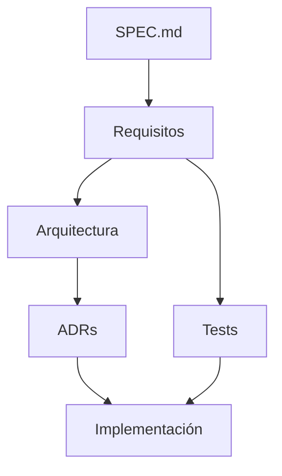

# Architecture Decision Records (ADR)

Este directorio contiene las decisiones arquitectónicas importantes del proyecto.

## Propósito

Un ADR registra una decisión, su contexto, las alternativas consideradas y sus consecuencias.

Los ADR no sustituyen a `SPEC.md` ni a los requisitos. Una decisión técnica debe explicar **cómo** se construirá algo; el requisito define **qué** debe hacer el producto.

## Formato

Cada decisión debe seguir esta estructura:

```text
# ADR-NNN — Título

## Estado

Propuesto | Aceptado | Rechazado | Reemplazado | Deprecated

## Contexto

¿Qué problema o necesidad originó la decisión?

## Decisión

¿Qué se decidió?

## Alternativas consideradas

¿Qué otras opciones se evaluaron?

## Consecuencias

¿Qué ventajas, costes o restricciones introduce?

## Reversibilidad

¿Qué tan fácil es cambiar esta decisión posteriormente?

## Impacto en agentes

¿Qué debe saber un agente de IA para respetar esta decisión?
```

## Reglas

1. No crear un ADR para cada detalle de implementación.
2. Crear un ADR cuando una decisión tenga impacto significativo, sea difícil de revertir o pueda generar confusión futura.
3. Una decisión aceptada debe ser respetada por los agentes hasta que exista un ADR posterior que la modifique.
4. Los ADR deben ser independientes del LLM utilizado.
5. Siempre que sea posible, representar las decisiones y relaciones mediante Mermaid.

## Índice

- `ADR-001-persistencia-inicial.md` — Persistencia inicial del MVP.
- `ADR-002-separacion-dominio-persistencia.md` — Separación entre dominio y almacenamiento.
- `ADR-003-arquitectura-llm-agnostica.md` — Uso de una capa documental independiente del proveedor de IA.

## Relación con otros documentos


