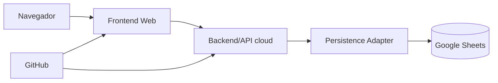
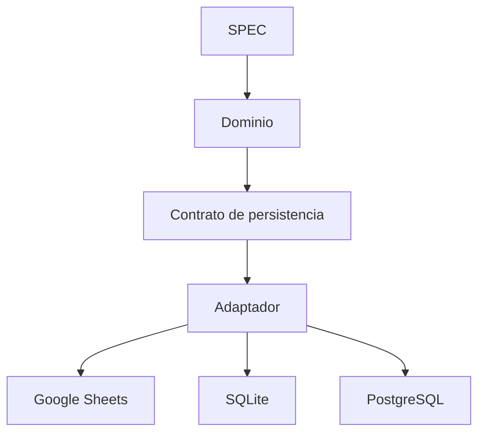
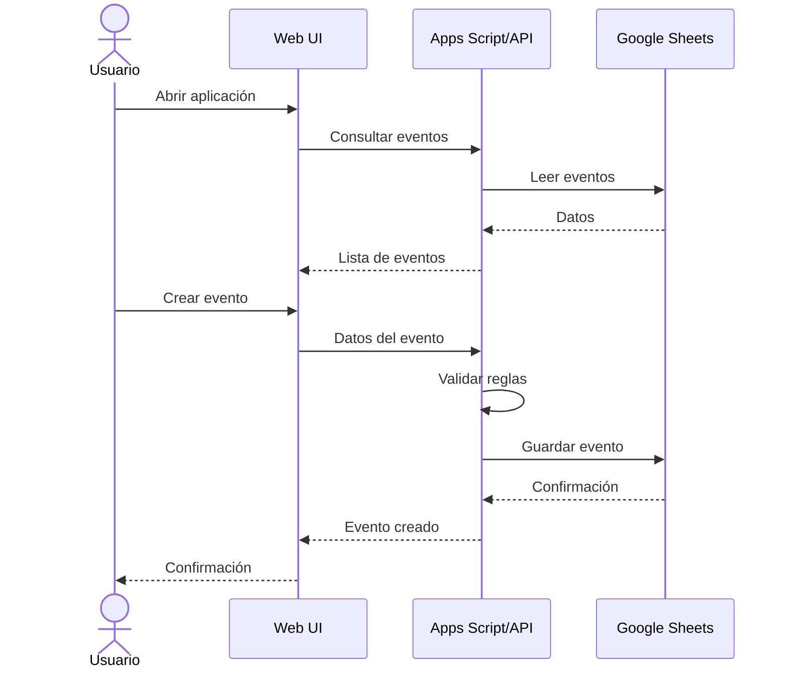

# DEMO-00 — Estrategia de demo sin instalación

## Objetivo

Permitir ejecutar y demostrar `eventos-sociales` desde un navegador, minimizando o eliminando la necesidad de instalar software en la laptop del usuario.

La estrategia está diseñada para validar el producto y el flujo `VS-001 — Crear y consultar evento` sin convertir las herramientas de demo en decisiones irreversibles de arquitectura.

## Restricción

La laptop puede tener restricciones para instalar Node.js, npm, Java, Maven, Docker, PostgreSQL u otras herramientas de desarrollo.

Por tanto, la demo debe privilegiar servicios accesibles desde navegador y ejecución remota/cloud.

## Estrategia recomendada para la primera demo



La primera implementación de demo puede utilizar **Google Sheets + Google Apps Script** como infraestructura de demostración, aprovechando que ambos son accesibles desde la nube y no requieren un servidor local.

Esto NO convierte Google Sheets en la base de datos obligatoria del producto.

## Principio de separación



El contrato de persistencia permanece estable. La demo implementa temporalmente ese contrato con Google Sheets.

## Alcance de la demo

La primera demo debe demostrar únicamente:

1. abrir la aplicación desde un navegador;
2. consultar eventos;
3. crear un evento;
4. validar los datos mínimos;
5. persistir el evento;
6. consultar nuevamente el evento creado;
7. mostrar errores de validación de manera comprensible.

No se incluyen todavía pagos, autenticación avanzada, contratación completa, notificaciones ni funcionalidades de IA.

## Flujo de demo



## Pantallas aproximadas

### Lista de eventos

```text
┌─────────────────────────────────────────────────────┐
│ EVENTOS SOCIALES                                    │
├─────────────────────────────────────────────────────┤
│                                                     │
│ Eventos                         [ + Nuevo evento ]  │
│                                                     │
│ ┌───────────────────────────────────────────────┐   │
│ │ Boda Juan y María                             │   │
│ │ 15/10/2026                                    │   │
│ │ Cliente: Juan Pérez                    [Ver]  │   │
│ └───────────────────────────────────────────────┘   │
│                                                     │
└─────────────────────────────────────────────────────┘
```

### Crear evento

```text
┌─────────────────────────────────────────────────────┐
│ NUEVO EVENTO                                         │
├─────────────────────────────────────────────────────┤
│                                                     │
│ Cliente       [ Seleccionar cliente        ▼ ]      │
│                                                     │
│ Nombre        [______________________________]      │
│                                                     │
│ Fecha         [____/____/________]                  │
│                                                     │
│               [ Cancelar ]  [ Crear evento ]        │
│                                                     │
└─────────────────────────────────────────────────────┘
```

Los wireframes son conceptuales y no constituyen todavía una decisión de framework frontend.

## Requisitos de acceso

Para esta estrategia, el usuario solo necesita:

- navegador web moderno;
- acceso a Internet;
- acceso autorizado a los recursos cloud utilizados;
- cuenta GitHub cuando corresponda al flujo de desarrollo.

No se presupone acceso administrativo a la laptop.

## Desarrollo desde navegador

Si la ejecución cloud disponible permite editar y ejecutar el proyecto remotamente, se podrá utilizar un entorno de desarrollo basado en navegador. La elección del proveedor concreto se documentará por separado y no formará parte del dominio.

## Datos de demo

La demo debe utilizar datos ficticios o de prueba. No deben incorporarse datos personales reales innecesarios.

Se recomienda disponer de una hoja separada para demo y no reutilizar información productiva.

## Seguridad mínima

- No guardar credenciales o secretos en GitHub.
- No publicar una hoja con información personal real.
- Restringir el acceso de edición de la hoja.
- Separar credenciales/configuración de código fuente.
- Si Apps Script se publica como Web App, definir explícitamente quién puede ejecutarlo y bajo qué identidad.

## Limitaciones aceptadas

Google Sheets no se considera la solución definitiva para:

- alta concurrencia;
- consultas complejas;
- transacciones empresariales complejas;
- grandes volúmenes de datos;
- seguridad y autorización avanzada;
- necesidades de escalabilidad de producción.

Estas limitaciones son aceptables para una demo controlada.

## Criterio de éxito

La estrategia se considera exitosa cuando una persona puede:

1. abrir la demo desde un navegador;
2. crear un evento válido;
3. comprobar que fue persistido;
4. consultar el evento;
5. provocar una validación inválida y observar el error;
6. realizar todo lo anterior sin instalar herramientas de desarrollo en su laptop.

## Relación con ADR-005

Esta estrategia permite retrasar la decisión definitiva del stack de producción. La demo cloud no debe modificar la arquitectura agnóstica definida por ADR-004 ni los contratos funcionales.

ADR-005 puede seleccionar posteriormente TypeScript, Java u otra implementación.

## Estado

**Propuesta para demo inicial.**

No autoriza todavía la creación de código de aplicación.
