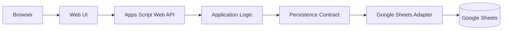
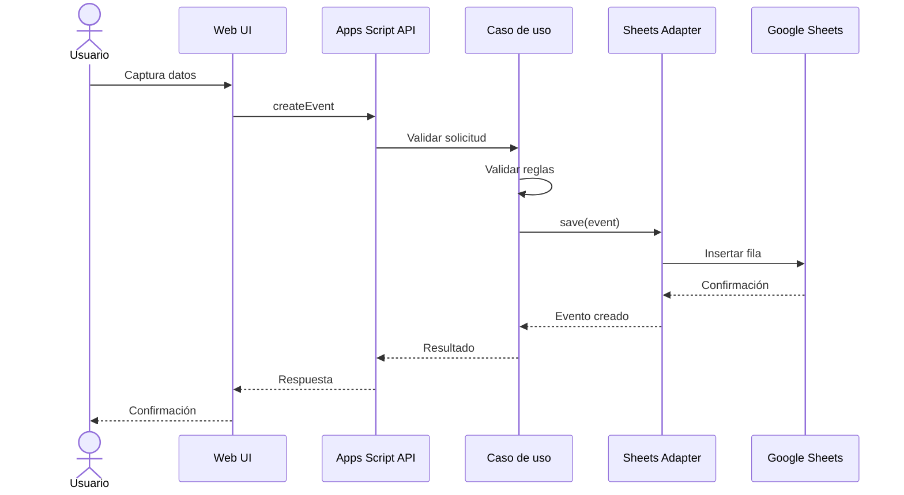
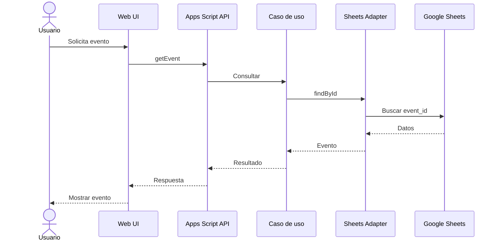
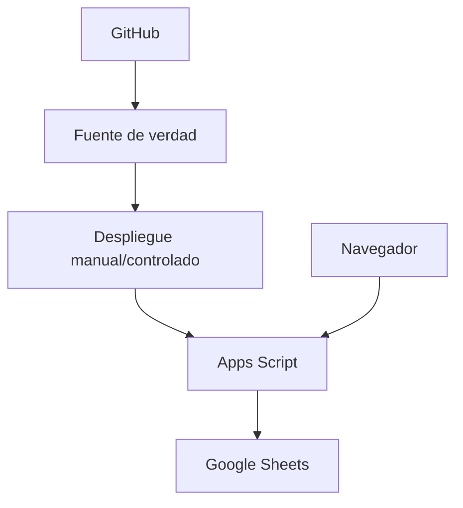
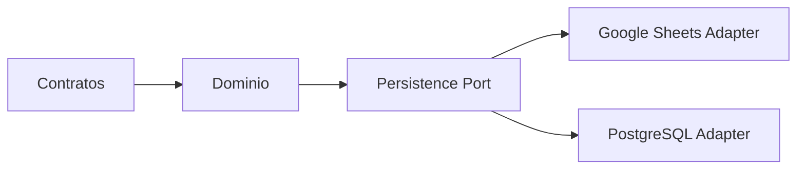

# DEMO-01 — Arquitectura de demo sin instalación

## Estado

Propuesta de implementación de demo. No contiene código.

## Objetivo

Permitir demostrar `VS-001 — Crear y consultar evento` desde un navegador, evitando instalaciones locales en la laptop del desarrollador.

La demo utiliza servicios disponibles en la nube y mantiene separadas las reglas de negocio, los contratos y el adaptador de persistencia.

## Arquitectura



La implementación de demo puede concentrar varias capas en Apps Script por simplicidad, pero los contratos conceptuales permanecen separados para facilitar una futura migración.

## Componentes

| Componente | Responsabilidad | Dependencia tecnológica |
|---|---|---|
| Web UI | Mostrar eventos, formulario y errores | Web browser |
| Apps Script Web API | Recibir solicitudes y devolver respuestas | Google Apps Script |
| Application Logic | Ejecutar el caso de uso | Conceptual, debe seguir contratos |
| Persistence Contract | Definir operaciones necesarias | Agnóstico |
| Google Sheets Adapter | Traducir operaciones al almacenamiento | Google Sheets |
| Google Sheets | Persistencia de demo | Google |

## Modelo de datos de demo

La hoja `events` contendrá:

| Columna | Requerida | Descripción |
|---|---:|---|
| event_id | Sí | Identificador único generado por el sistema |
| client_id | Sí | Referencia al cliente |
| name | Sí | Nombre o descripción del evento |
| event_date | Sí | Fecha del evento |
| status | Sí | Estado inicial del evento |
| created_at | Sí | Fecha/hora de creación |
| updated_at | Sí | Fecha/hora de última actualización |

La hoja `clients` será una referencia mínima para validar `client_id` durante la demo.

| Columna | Requerida | Descripción |
|---|---:|---|
| client_id | Sí | Identificador único |
| name | Sí | Nombre del cliente |
| active | Sí | Indica si puede asociarse a nuevos eventos |

## Regla de alcance

La demo no implementa todavía un alta completo de clientes. Debe existir al menos un cliente de prueba previamente registrado para poder crear un evento.

## Contrato conceptual: crear evento

### Request

```json
{
  "operation": "createEvent",
  "clientId": "CLI-001",
  "name": "Evento de demostración",
  "eventDate": "2026-10-15"
}
```

### Success response

```json
{
  "success": true,
  "data": {
    "eventId": "EVT-...",
    "clientId": "CLI-001",
    "name": "Evento de demostración",
    "eventDate": "2026-10-15",
    "status": "BORRADOR"
  }
}
```

### Error response

```json
{
  "success": false,
  "error": {
    "code": "CLIENT_NOT_FOUND",
    "message": "El cliente indicado no existe o no está disponible."
  }
}
```

Los códigos son parte del contrato de demo y deberán alinearse con el contrato definitivo antes de producción.

## Contrato conceptual: consultar evento

### Request

```json
{
  "operation": "getEvent",
  "eventId": "EVT-001"
}
```

### Success response

```json
{
  "success": true,
  "data": {
    "eventId": "EVT-001",
    "clientId": "CLI-001",
    "name": "Evento de demostración",
    "eventDate": "2026-10-15",
    "status": "BORRADOR"
  }
}
```

## Validaciones mínimas

1. `clientId` es obligatorio.
2. El cliente debe existir y estar activo.
3. `name` es obligatorio.
4. `eventDate` es obligatorio.
5. `eventDate` debe tener formato de fecha válido según el contrato.
6. El sistema genera `eventId`; el cliente no lo proporciona.
7. El estado inicial es `BORRADOR` mientras esa regla siga vigente en la especificación.
8. Una solicitud inválida no debe crear una fila parcialmente válida.

## Flujo de creación



## Flujo de consulta



## Seguridad de la demo

La demo debe tratarse como entorno de demostración, no como producción.

Principios mínimos:

- no almacenar secretos en GitHub;
- no publicar credenciales de Google;
- limitar el acceso al documento de Sheets al propietario/usuarios autorizados;
- validar todas las entradas recibidas por la API;
- no confiar en `clientId` ni `eventId` enviados por el navegador;
- generar identificadores en el servidor de demo;
- evitar registrar datos sensibles innecesarios;
- separar datos de prueba de datos reales.

Si la demo se publica como aplicación web, el nivel de acceso debe ser el mínimo compatible con la demostración y deberá documentarse explícitamente.

## Estrategia de despliegue



La primera versión puede utilizar despliegue manual para reducir complejidad. La automatización del despliegue se evaluará después de validar el flujo.

## Relación con producción



La migración a otra base de datos no debe cambiar el contrato funcional de `VS-001`. El adaptador de persistencia es la zona de sustitución.

## Tests antes de implementación

La demo deberá definir al menos:

### Unitarios conceptuales

- crear evento con datos válidos;
- rechazar cliente inexistente;
- rechazar cliente inactivo;
- rechazar nombre vacío;
- rechazar fecha inválida;
- generar identificador único;
- asignar estado inicial.

### Integración

- guardar evento en Sheets;
- consultar evento guardado;
- devolver error cuando no existe.

### Aceptación

- usuario crea un evento desde navegador;
- usuario visualiza confirmación;
- usuario consulta el evento creado.

## Limitaciones conocidas

- Google Sheets no es la BD definitiva.
- Apps Script no representa necesariamente la arquitectura de producción.
- La demo no pretende validar carga, concurrencia ni disponibilidad de producción.
- El objetivo es validar el flujo funcional y la arquitectura de contratos.

## Criterio de salida

La estrategia se considera validada cuando un usuario puede ejecutar `VS-001` desde un navegador sin instalar software local y obtener un evento persistido y consultable en el almacenamiento de demo.

## Próximo paso

Antes de crear código, revisar este documento contra `SPEC.md`, `VS-001` y `ADR-005`. Después se podrá crear la especificación técnica del adaptador Google Sheets y, únicamente cuando se autorice, implementar el código de demo.
