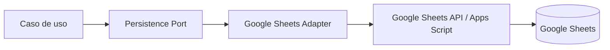
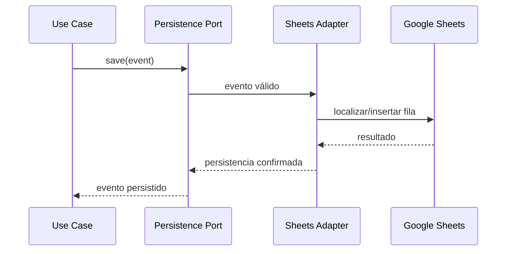
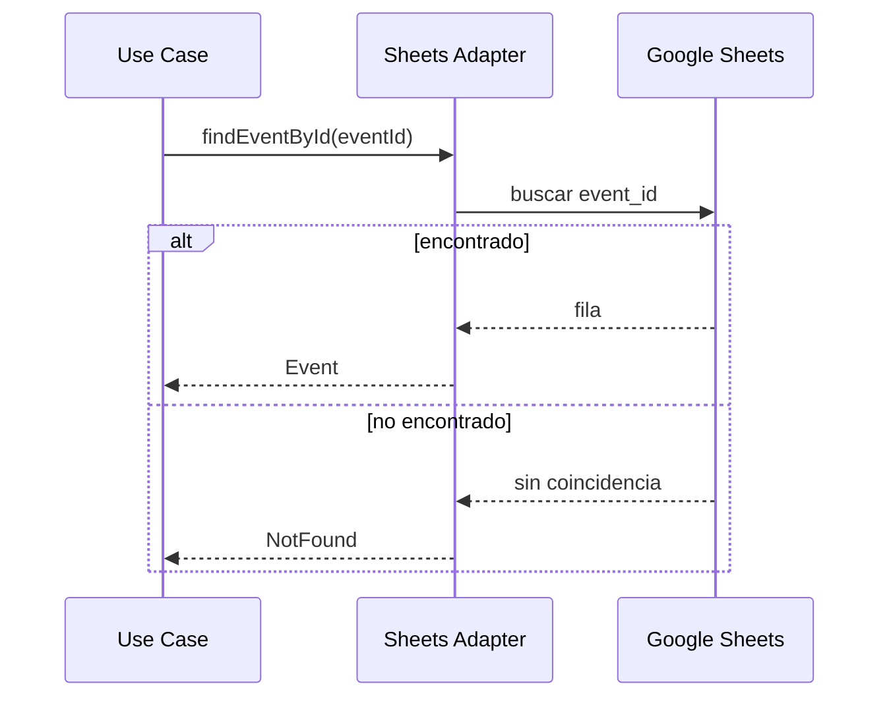
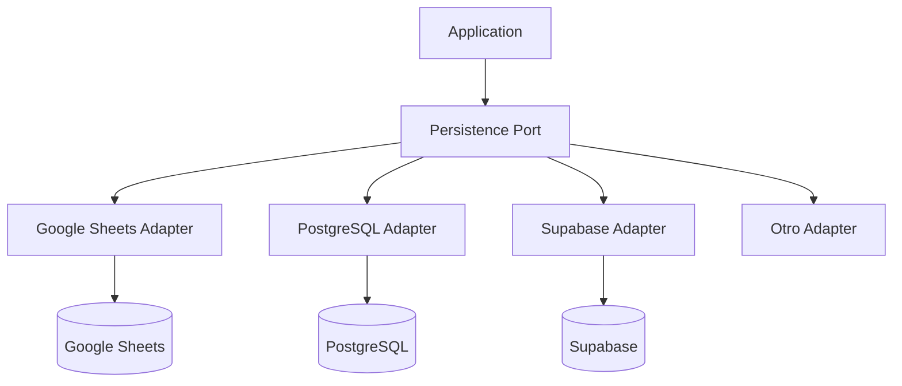

# DEMO-02 — Adaptador de persistencia Google Sheets

## Estado

Diseñado — sin código de aplicación

## Objetivo

Definir cómo la implementación de demostración utilizará Google Sheets como infraestructura de persistencia sin convertir Sheets en parte del dominio ni del contrato funcional.

## Principio



El dominio no conocerá nombres de hojas, rangos, columnas ni APIs de Google.

## Modelo físico de demo

### Hoja `clients`

| Columna | Tipo lógico | Requerido | Observación |
|---|---|---|---|
| client_id | string | Sí | ID generado por servidor |
| name | string | Sí | Nombre del cliente |
| active | boolean | Sí | Permite desactivar sin borrar |
| created_at | datetime | Sí | Fecha de creación |
| updated_at | datetime | Sí | Última actualización |

### Hoja `events`

| Columna | Tipo lógico | Requerido | Observación |
|---|---|---|---|
| event_id | string | Sí | ID generado por servidor |
| client_id | string | Sí | Referencia lógica a `clients` |
| name | string | Sí | Nombre/descripcion del evento |
| event_date | date | Sí | Fecha del evento |
| status | enum | Sí | Estado del evento |
| created_at | datetime | Sí | Fecha de creación |
| updated_at | datetime | Sí | Última actualización |

## Contrato lógico del puerto

El contrato conceptual es independiente de Google Sheets:

```text
saveEvent(event)
findEventById(eventId)
existsClient(clientId)
```

Los nombres anteriores son orientativos; el contrato definitivo deberá derivarse del caso de uso y no de la API de Sheets.

## Operación `saveEvent`

Flujo:



Reglas:

1. El `event_id` se genera antes de persistir.
2. El adaptador no acepta IDs generados por el navegador como fuente de verdad.
3. `client_id` debe existir y corresponder a un cliente activo cuando la regla de negocio así lo requiera.
4. El adaptador traduce errores de infraestructura a errores definidos por el contrato de aplicación.
5. No se mezclan datos de prueba con datos reales.

## Operación `findEventById`



## Consistencia

Google Sheets no debe considerarse una base transaccional completa. Para el MVP:

- las operaciones de una sola fila serán la unidad mínima de persistencia;
- se evitarán operaciones parcialmente ejecutadas que requieran múltiples escrituras inseparables;
- la validación del cliente y del evento se realizará antes de insertar;
- se verificará la existencia del cliente antes de crear el evento;
- cualquier necesidad futura de transacción real será una señal para cambiar de adaptador/BD, no para introducir lógica de infraestructura en el dominio.

## Identificadores

Formato recomendado para la demo:

```text
CLIENT-<identificador-único>
EVENT-<identificador-único>
```

El formato exacto queda como detalle de implementación. El dominio solo requiere identificadores únicos y estables.

## Fechas

La persistencia debe conservar una representación inequívoca. El contrato lógico utilizará valores de fecha/hora normalizados; el adaptador será responsable de convertirlos al formato de Sheets.

## Errores de infraestructura

El adaptador debe distinguir, como mínimo:

```text
NOT_FOUND
DUPLICATE_ID
INVALID_REFERENCE
PERSISTENCE_ERROR
UNAVAILABLE
```

Estos códigos no deben exponerse necesariamente con el mismo detalle al usuario final.

## Seguridad

- El identificador de la hoja y cualquier secreto/configuración sensible no se almacenarán en código público.
- El acceso a Sheets se realizará mediante la identidad/autorización configurada para Apps Script.
- No se permitirá que el cliente web escriba directamente en la hoja.
- La API validará entradas antes de invocar al adaptador.

## Evolución a otra BD



Cambiar de persistencia deberá afectar principalmente al adaptador y su configuración. No deberá modificar el dominio ni los requisitos funcionales.

## Testing antes de código

Se deben preparar los siguientes escenarios:

### Unitarios

- crea evento con datos válidos;
- rechaza cliente inexistente;
- rechaza nombre vacío;
- rechaza fecha inválida;
- genera identificador único;
- establece estado inicial definido por la especificación.

### Integración

- guarda evento en hoja `events`;
- recupera evento por ID;
- rechaza referencia a cliente inexistente;
- traduce error de Sheets a error de aplicación.

### Aceptación

- usuario crea evento desde la UI;
- evento aparece en la consulta;
- error de validación se muestra correctamente.

## Criterio para autorizar código

El código de la demo solo podrá comenzar cuando estén aprobados:

- ADR-005;
- contrato VS-001;
- este diseño de adaptador;
- casos de prueba;
- configuración de acceso a Google Sheets.

**Este documento no contiene código de aplicación.**
