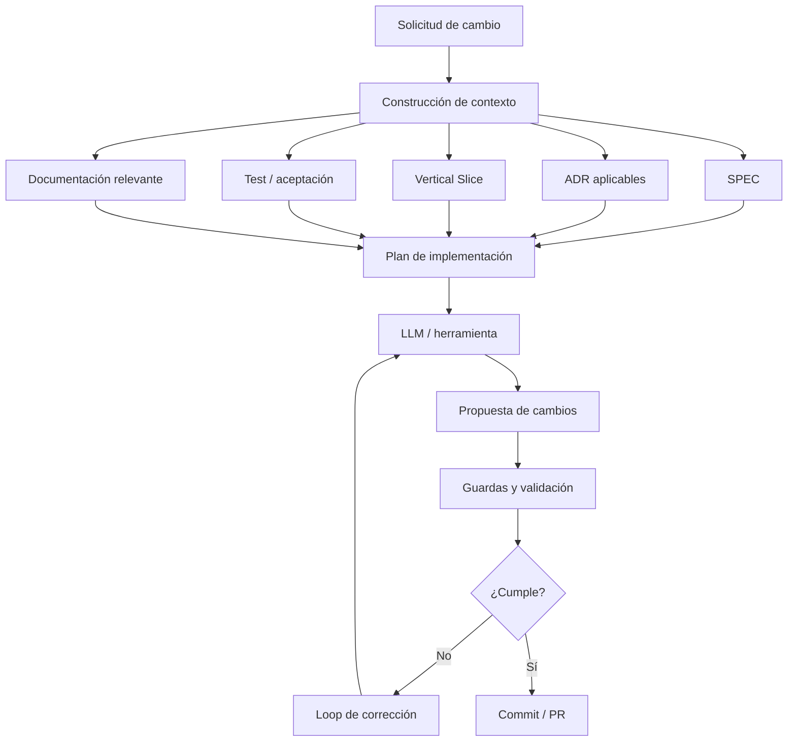
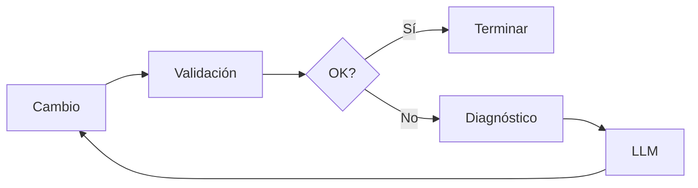

# HARNESS-001 — Cambio controlado

## Estado

**Definido — implementación pendiente**

## Propósito

Definir un mecanismo LLM-agnóstico y lenguaje-agnóstico para transformar una solicitud de cambio en una modificación verificable del repositorio.

HARNESS-001 no es un LLM. Es el conjunto de reglas, contexto, controles y validaciones que rodean al LLM o herramienta de desarrollo.

Debe permitir trabajar con distintos proveedores o herramientas, por ejemplo Codex, Copilot, Claude u otros, sin convertir ninguno de ellos en una dependencia arquitectónica del producto.

## Problema que resuelve

Actualmente el repositorio contiene SPEC, ADR, vertical slices, contratos, casos de prueba y código. Un cambio puede requerir interpretar varias de estas fuentes.

Sin un Harness, el desarrollador o LLM debe descubrir manualmente qué información consultar y qué validar.

HARNESS-001 establece un flujo reproducible:



## Principios

1. **LLM-agnóstico:** ningún proveedor concreto es requisito del Harness.
2. **Lenguaje-agnóstico:** el contrato no depende de Java, TypeScript, Python, Apps Script u otro lenguaje.
3. **Repositorio como fuente de verdad:** el contexto debe derivarse prioritariamente de artefactos versionados.
4. **Cambio mínimo:** modificar únicamente lo necesario para cumplir el objetivo.
5. **Trazabilidad:** cada cambio debe poder relacionarse con un requisito, slice, ADR o test.
6. **Validación obligatoria:** una modificación no se considera terminada solo porque el LLM la haya producido.
7. **Seguridad por defecto:** secretos, credenciales y datos sensibles no forman parte del contexto ni de los cambios normales.
8. **Reproducibilidad:** otro LLM debería poder recibir el mismo contexto y restricciones y comprender el mismo objetivo.

## Entrada

HARNESS-001 recibe como mínimo:

- solicitud de cambio;
- identificador del requisito o Vertical Slice cuando exista;
- restricciones explícitas;
- estado actual del repositorio.

Ejemplo:

```text
Cambio: implementar TC-007 para consultar un evento existente.
Slice: VS-001.
Restricción: no modificar el contrato de getEvent().
Restricción: no introducir secretos.
```

## Construcción de contexto

El Harness debe localizar y proporcionar únicamente el contexto relevante.

Orden conceptual de prioridad:

1. requisito/SPEC aplicable;
2. ADR aplicables;
3. Vertical Slice;
4. contratos;
5. casos de prueba;
6. arquitectura relevante;
7. código afectado;
8. documentación auxiliar.

No se debe cargar indiscriminadamente todo el repositorio cuando un subconjunto suficiente sea identificable.

## Salida del LLM

La salida esperada no es solamente código. Debe incluir conceptualmente:

```text
Objetivo
Contexto utilizado
Archivos afectados
Plan de cambio
Cambios realizados
Tests ejecutados
Resultado de validación
Riesgos / decisiones pendientes
```

La forma concreta puede adaptarse al proveedor o herramienta.

## Límites de modificación

Antes de permitir una modificación, el Harness debe poder determinar:

- archivos candidatos;
- archivos protegidos o fuera de alcance;
- restricciones derivadas de ADR;
- tests relevantes;
- documentación que podría requerir actualización.

Si el cambio implica una decisión arquitectónica no resuelta, el Harness debe detenerse y solicitar un ADR o decisión explícita en lugar de inventarla.

## Validación

La validación debe comprobar, según corresponda:

- formato/sintaxis;
- tests unitarios;
- tests de integración;
- tests de aceptación;
- reglas de seguridad;
- consistencia documental;
- ausencia de secretos;
- trazabilidad con el cambio solicitado.

No todos los repositorios tendrán las mismas herramientas de validación. El Harness debe descubrir las capacidades disponibles en el proyecto y aplicar las que estén definidas como obligatorias.

## Loop

Cuando una validación falla, el Harness puede iniciar un loop de corrección:



El loop debe tener límites configurables para evitar ciclos indefinidos.

## Seguridad

HARNESS-001 debe impedir o detectar:

- secretos en archivos modificados;
- credenciales en prompts/contexto;
- cambios fuera del alcance autorizado;
- eliminación accidental de controles de seguridad;
- exposición de datos reales en artefactos de demo;
- incorporación de dependencias no autorizadas cuando una política lo prohíba.

## Ejemplo: TC-007

Para el caso real detectado durante VS-001:

```text
Solicitud
  ↓
TC-007: consultar evento existente
  ↓
Contexto
  ├─ VS-001
  ├─ TC-007
  ├─ contrato getEvent
  ├─ ADR aplicables
  └─ index.html / código relevante
  ↓
Plan
  └─ agregar UI de consulta sin cambiar contrato
  ↓
LLM
  ↓
Cambio en index.html
  ↓
Validación
  ├─ TC-007
  ├─ pruebas existentes
  └─ seguridad
  ↓
Commit / PR
```

## Criterios de aceptación

### HA-001 — Independencia del proveedor

**Given** el mismo repositorio y solicitud

**When** se utiliza un LLM o herramienta compatible diferente

**Then** el Harness proporciona el mismo contrato de contexto, restricciones y validación.

### HA-002 — Trazabilidad

**Given** una solicitud de cambio

**When** se construye el contexto

**Then** el resultado identifica las fuentes relevantes que justifican el cambio.

### HA-003 — Alcance

**Given** un cambio limitado a un Vertical Slice

**When** el LLM propone modificaciones

**Then** el Harness identifica archivos fuera de alcance y puede bloquear modificaciones no justificadas.

### HA-004 — Validación

**Given** un cambio generado

**When** termina la modificación

**Then** se ejecutan las validaciones obligatorias definidas por el proyecto.

### HA-005 — Loop controlado

**Given** una validación fallida

**When** se solicita corrección

**Then** el Harness proporciona el diagnóstico al siguiente ciclo

**And** respeta el límite máximo de iteraciones.

### HA-006 — Seguridad

**Given** un cambio que introduce un secreto

**When** se ejecutan las guardas

**Then** el Harness bloquea el cambio.

### HA-007 — Decisiones arquitectónicas

**Given** que un cambio requiere una decisión no documentada

**When** el LLM intenta resolverla por inferencia

**Then** el Harness puede detener el flujo y exigir una decisión/ADR antes de continuar.

## Relación con otros elementos

```text
SPEC
  ↓
Vertical Slice
  ↓
Tests
  ↓
HARNESS-001
  ├── Contexto
  ├── LLM
  ├── Seguridad
  ├── Loops
  └── Validación
       ↓
Git / PR
```

HARNESS-001 es un componente de proceso/ingeniería. No sustituye:

- SPEC;
- SKILLS;
- MEMORY;
- RAG;
- MCP;
- ADR;
- tests;
- documentación;
- orquestación.

Los coordina o consume cuando corresponda.

## No objetivos de esta versión

HARNESS-001 v0 no pretende:

- ejecutar agentes autónomos ilimitados;
- seleccionar por sí mismo el mejor LLM;
- sustituir revisión humana en decisiones críticas;
- resolver automáticamente cualquier conflicto arquitectónico;
- implementar RAG o MCP todavía;
- definir una herramienta concreta de CI/CD.

## Criterio de salida

HARNESS-001 podrá pasar a implementación cuando:

- sus criterios de aceptación estén cubiertos por pruebas del propio Harness;
- exista una estrategia clara para construir contexto;
- exista una política de archivos modificables;
- exista una estrategia de validación;
- exista un límite de loops;
- se pueda ejecutar el mismo flujo con más de un LLM/herramienta sin cambiar el contrato del proyecto.
