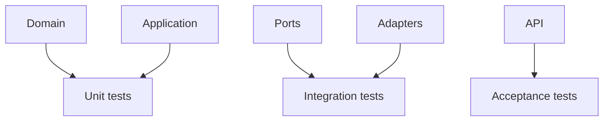
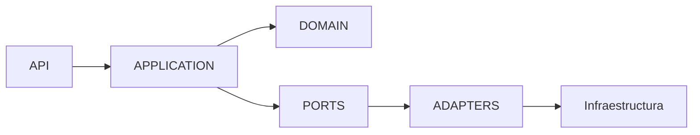

# MVP-00 — Estructura técnica previa al código

## Propósito

Definir la estructura de implementación que debe existir antes de crear código, sin introducir todavía archivos fuente ni casarla con un lenguaje concreto.

## Estructura lógica

```text
implementation/
├── domain/
├── application/
├── ports/
├── adapters/
└── api/

tests/
├── unit/
├── integration/
└── acceptance/
```

La estructura física podrá adaptarse al lenguaje/framework elegido en ADR-005. La separación conceptual es obligatoria; los nombres físicos de carpetas son orientativos hasta aceptar el stack.

## Responsabilidad de cada capa

### Domain

Reglas de negocio y conceptos del dominio. No depende de base de datos, framework web ni proveedor de LLM.

### Application

Casos de uso y coordinación de operaciones. Orquesta el dominio y utiliza contratos/puertos.

### Ports

Contratos hacia infraestructura o servicios externos, por ejemplo persistencia o notificaciones.

### Adapters

Implementaciones concretas de puertos. Aquí se concentra el acoplamiento tecnológico.

### API

Exposición de los casos de uso hacia clientes externos, incluyendo validación de entrada y transformación de respuestas.

## Testing



Los tests deben verificar comportamiento y contratos. No deben depender de una implementación interna cuando pueda evitarse.

## Contrato entre capas



Las dependencias deben apuntar hacia conceptos estables del dominio, evitando que la infraestructura se convierta en la fuente de verdad.

## Configuración

La configuración sensible deberá provenir del entorno de ejecución o mecanismo seguro equivalente. Nunca se almacenarán secretos en el repositorio.

## CI mínima

Antes de integrar código a la rama principal, CI deberá poder ejecutar al menos:

1. validación de estructura/configuración;
2. formato/lint si el stack lo requiere;
3. tests unitarios;
4. tests de integración disponibles;
5. comprobaciones de seguridad aplicables.

## Regla para agentes

Un agente que vaya a crear código debe leer, como mínimo:

- `PROJECT.md`;
- `SPEC.md`;
- `AGENTS.md`;
- ADR-004;
- ADR-005;
- el vertical slice correspondiente.

No debe crear archivos de implementación hasta que ADR-005 pase a **Aceptado**.

## Estado

**Preparado para selección final del stack.** No contiene código de aplicación.
