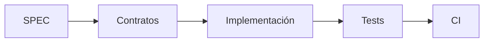

# MVP-00 — Fundación

## Objetivo

Preparar la base mínima y reproducible del proyecto antes de implementar funcionalidades de negocio.

## Alcance

- estructura inicial de implementación;
- estrategia de configuración;
- separación entre dominio, contratos y adaptadores;
- estrategia de tests;
- validaciones automáticas;
- seguridad básica del repositorio;
- documentación operativa para agentes;
- trazabilidad entre requisitos, tests y código.

## Fuera de alcance

- funcionalidad completa de clientes;
- funcionalidad completa de eventos;
- pagos;
- facturación;
- integraciones externas complejas;
- funcionalidades avanzadas de IA.

## Principio de implementación

El lenguaje y framework concretos se consideran una decisión de implementación. No deben filtrarse hacia SPEC, requisitos, dominio conceptual ni wireframes.

## Tareas

### MVP-00-01 — Estructura del proyecto

Definir la estructura de directorios de código, tests, configuración y documentación.

### MVP-00-02 — Contratos base

Definir las interfaces/contratos necesarios para evitar acoplar el dominio a la persistencia o infraestructura.

### MVP-00-03 — Testing

Configurar el mecanismo de tests unitarios y establecer una primera prueba ejecutable.

### MVP-00-04 — Calidad automática

Configurar validaciones automáticas apropiadas: tests, formato, análisis estático y, cuando corresponda, seguridad.

### MVP-00-05 — CI

Preparar GitHub Actions para ejecutar las validaciones antes de integrar cambios en `main`.

### MVP-00-06 — Seguridad

Verificar que no existan secretos en el repositorio y documentar prácticas mínimas de manejo de configuración sensible.

### MVP-00-07 — Guía de agentes

Verificar que `PROJECT.md`, `SPEC.md`, `AGENTS.md`, Skills y ADRs proporcionen suficiente contexto para que distintos agentes puedan ejecutar una tarea de forma consistente.

## Definition of Done

MVP-00 se considera terminado cuando:

- la estructura de implementación está definida;
- existe al menos un test ejecutable;
- las validaciones automáticas están definidas;
- CI puede ejecutar dichas validaciones;
- no hay secretos en el repositorio;
- un agente nuevo puede identificar cómo comenzar una tarea sin depender de esta conversación;
- la implementación sigue los contratos definidos;
- la documentación de estado queda actualizada.

## Siguiente vertical slice

Una vez terminado MVP-00, implementar `VS-001 — Registrar cliente`.
