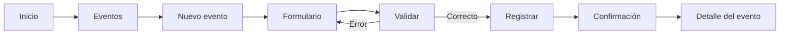
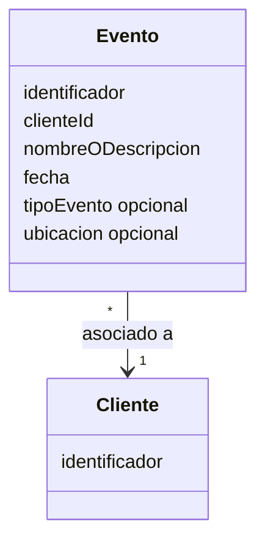
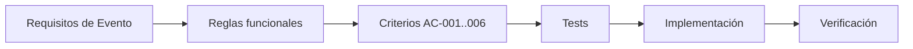

# VS-001 — Crear y consultar evento

## 1. Objetivo

Demostrar el primer flujo vertical de negocio del sistema: permitir crear un evento y posteriormente consultarlo.

Este slice se prioriza porque `Evento` representa el núcleo operativo del producto y permite validar de extremo a extremo la arquitectura: interfaz, contrato, aplicación, dominio, persistencia, validación, errores y tests.

## 2. Alcance

Incluye:

- visualizar la opción de crear evento;
- capturar los datos mínimos del evento;
- validar los datos obligatorios;
- seleccionar/referenciar un cliente existente y válido;
- registrar el evento;
- generar un identificador único;
- mostrar confirmación;
- consultar el evento mediante su identificador.

No incluye:

- alta de clientes;
- contratación de servicios;
- pagos;
- notificaciones externas;
- edición del evento;
- eliminación del evento;
- gestión avanzada de clientes;
- IA para enriquecer datos;
- tecnología específica de frontend/backend/persistencia.

## 3. Reglas funcionales cerradas

Las reglas mínimas se derivan directamente de `SPEC.md`:

1. Todo evento debe tener un identificador único.
2. Todo evento debe tener una fecha.
3. Todo evento debe tener un nombre o descripción.
4. Todo evento debe estar asociado a un cliente válido.
5. La creación debe rechazarse si falta cualquiera de los datos obligatorios.
6. La creación debe rechazarse si el cliente referenciado no existe o no es válido.
7. Una creación aceptada debe quedar persistida.
8. Un evento persistido debe poder recuperarse mediante su identificador.
9. La consulta debe devolver la identidad y los datos registrados del evento.

### Campos mínimos para VS-001

| Campo | Obligatorio | Regla |
|---|---|---|
| Identificador | Sí, generado por el sistema | Único |
| Cliente | Sí | Debe existir y ser válido |
| Nombre o descripción | Sí | No puede estar ausente/vacío |
| Fecha | Sí | Debe ser una fecha válida |

`Tipo de evento` y `Ubicación` pueden mostrarse en el wireframe como datos opcionales, pero **no son obligatorios para VS-001** hasta que el SPEC los defina como tales.

## 4. Requisitos relacionados

- Registrar eventos.
- Consultar eventos.
- Reglas de negocio de `SPEC.md` relativas a Evento.

## 5. Criterios de aceptación

### AC-001 — Alta válida

```text
Given existe un cliente válido
And el usuario proporciona nombre o descripción
And proporciona una fecha válida
When confirma el registro
Then el sistema registra el evento
And genera un identificador único
And muestra una confirmación
```

### AC-002 — Campo obligatorio ausente

```text
Given el usuario está en el formulario de evento
When intenta registrar sin cliente, nombre/descripcion o fecha
Then el sistema rechaza el registro
And informa qué dato debe corregirse
And no crea el evento
```

### AC-003 — Cliente no válido

```text
Given el evento requiere un cliente asociado
When el usuario proporciona un cliente inexistente o no válido
Then el sistema rechaza el registro
And informa la causa
And no crea el evento
```

### AC-004 — Identificador único

```text
Given se registran dos eventos válidos
When el sistema genera sus identificadores
Then los identificadores son diferentes
```

### AC-005 — Consulta posterior

```text
Given un evento fue registrado correctamente
When el usuario consulta el evento mediante su identificador
Then el sistema devuelve el mismo evento
And conserva su identidad y datos registrados
```

### AC-006 — Persistencia

```text
Given el registro fue aceptado
When termina la operación
Then el evento queda persistido
And puede recuperarse posteriormente
```

## 6. Flujo de usuario



## 7. Wireframe conceptual

> Este wireframe describe intención funcional y distribución aproximada. No representa el diseño visual final.

```text
┌─────────────────────────────────────────────────────────┐
│ EVENTOS SOCIALES                              Usuario ▼ │
├─────────────────────────────────────────────────────────┤
│                                                         │
│  Eventos                                                │
│  ─────────────────────────────────────────────────────  │
│                                                         │
│  Nuevo evento                                           │
│                                                         │
│  Cliente *                                              │
│  ┌───────────────────────────────────────────────────┐  │
│  │ Seleccionar cliente                           ▼   │  │
│  └───────────────────────────────────────────────────┘  │
│                                                         │
│  Nombre / descripción *                                 │
│  ┌───────────────────────────────────────────────────┐  │
│  │                                                   │  │
│  └───────────────────────────────────────────────────┘  │
│                                                         │
│  Fecha *                                                │
│  ┌───────────────────┐                                  │
│  │                   │                                  │
│  └───────────────────┘                                  │
│                                                         │
│  Tipo de evento              Ubicación                  │
│  ┌───────────────────────┐   ┌────────────────────────┐ │
│  │                       │   │                        │ │
│  └───────────────────────┘   └────────────────────────┘ │
│                                                         │
│                         [Cancelar]  [Crear evento]      │
└─────────────────────────────────────────────────────────┘
```

### Estado de confirmación

```text
┌─────────────────────────────────────────────────────────┐
│ ✓ Evento registrado                                     │
│                                                         │
│ Evento: Nombre del evento                               │
│ Identificador: EVT-XXXX                                 │
│                                                         │
│ [Ver evento]                    [Crear otro evento]      │
└─────────────────────────────────────────────────────────┘
```

## 8. Contrato funcional

La interfaz debe poder expresar, sin depender de una tecnología concreta:

```text
Crear evento
Consultar evento por identificador
```

### Entrada mínima conceptual para crear

```text
clienteId
nombreODescripcion
fecha
```

### Salida mínima conceptual

```text
identificador
clienteId
nombreODescripcion
fecha
```

El formato técnico del API se definirá en la capa de contratos/API correspondiente.

## 9. Modelo conceptual mínimo



## 10. Tests mínimos

### Unitarios

- evento válido puede crearse;
- nombre/descripcion obligatorio es validado;
- fecha obligatoria y válida es validada;
- cliente obligatorio es validado;
- cliente inválido es rechazado;
- identificador generado es único;
- datos inválidos son rechazados.

### Integración

- evento creado puede persistirse;
- evento persistido puede recuperarse por identificador.

### Aceptación

- usuario selecciona un cliente existente;
- usuario completa formulario y registra evento;
- usuario recibe confirmación;
- usuario consulta el evento registrado.

## 11. Trazabilidad



## 12. Dependencias

- modelo conceptual de evento;
- cliente existente y válido;
- reglas generales de seguridad;
- contrato de persistencia;
- estrategia de identificadores;
- stack de implementación, cuando se seleccione;
- configuración de ejecución de tests.

## 13. Definition of Done

- [x] requisitos mínimos de Evento revisados y trazados;
- [x] reglas funcionales mínimas cerradas;
- [x] criterios de aceptación definidos;
- [x] wireframe aprobado como referencia funcional;
- [x] contrato conceptual definido;
- [ ] tests unitarios implementados;
- [ ] tests de integración implementados cuando exista infraestructura;
- [ ] flujo de aceptación validado;
- [ ] implementación completa;
- [ ] documentación actualizada;
- [ ] seguridad revisada;
- [ ] sin secretos en el repositorio.

## 14. Siguiente paso

Definir el stack de implementación concreto y completar MVP-00 para poder crear el primer test ejecutable sin introducir acoplamiento tecnológico en la especificación.
