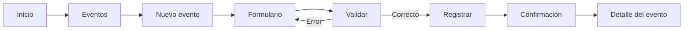
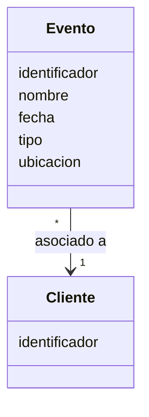
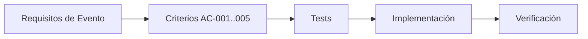

# VS-001 — Crear y consultar evento

## 1. Objetivo

Demostrar el primer flujo vertical de negocio del sistema: permitir crear un evento y posteriormente consultarlo.

Este slice se prioriza porque `Evento` representa el núcleo operativo del producto y permite validar de extremo a extremo la arquitectura: interfaz, contrato, aplicación, dominio, persistencia, validación, errores y tests.

La gestión de clientes queda como capacidad de soporte y dependencia del dominio cuando el modelo vigente requiera asociar un evento a un cliente.

## 2. Alcance

Incluye:

- visualizar la opción de crear evento;
- capturar los datos mínimos del evento;
- validar los datos obligatorios;
- asociar el evento a un cliente válido cuando esa relación sea obligatoria según el modelo de dominio;
- registrar el evento;
- devolver/mostrar un identificador único;
- mostrar confirmación;
- permitir consultar el evento recién registrado.

No incluye:

- contratación de servicios;
- pagos;
- notificaciones externas;
- edición del evento;
- eliminación del evento;
- gestión avanzada de clientes;
- IA para enriquecer datos;
- tecnología específica de frontend/backend/persistencia.

## 3. Requisitos relacionados

Este vertical slice debe trazarse contra los requisitos vigentes de creación y consulta de eventos en `SPEC.md` y `docs/02-requisitos.md`.

Si el modelo vigente exige un cliente asociado, deberá existir una forma válida de seleccionar o referenciar un cliente. Esto no implica que el alta completa de clientes forme parte de VS-001.

## 4. Criterios de aceptación

### AC-001 — Alta válida

```text
Given el usuario está en el formulario de evento
And proporciona los datos obligatorios válidos
When confirma el registro
Then el sistema registra el evento
And genera un identificador único
And muestra una confirmación
```

### AC-002 — Campo obligatorio ausente

```text
Given el usuario está en el formulario de evento
When intenta registrar sin un dato obligatorio
Then el sistema rechaza el registro
And informa qué dato debe corregirse
And no crea el evento
```

### AC-003 — Cliente no válido

```text
Given el evento requiere un cliente asociado
When el usuario proporciona un cliente inexistente o no válido
Then el sistema rechaza el registro
And informa la causa
And no crea el evento
```

### AC-004 — Consulta posterior

```text
Given un evento fue registrado correctamente
When el usuario consulta el evento mediante su identificador
Then el sistema devuelve el mismo evento
And conserva su identidad y datos registrados
```

### AC-005 — Persistencia

```text
Given el registro fue aceptado
When termina la operación
Then el evento queda persistido
And puede recuperarse posteriormente
```

## 5. Flujo de usuario



## 6. Wireframe conceptual

> Este wireframe describe intención funcional y distribución aproximada. No representa el diseño visual final.

```text
┌─────────────────────────────────────────────────────────┐
│ EVENTOS SOCIALES                              Usuario ▼ │
├─────────────────────────────────────────────────────────┤
│                                                         │
│  Eventos                                                │
│  ─────────────────────────────────────────────────────  │
│                                                         │
│  Nuevo evento                                           │
│                                                         │
│  Cliente *                                              │
│  ┌───────────────────────────────────────────────────┐  │
│  │ Seleccionar cliente                           ▼   │  │
│  └───────────────────────────────────────────────────┘  │
│                                                         │
│  Nombre del evento *                                    │
│  ┌───────────────────────────────────────────────────┐  │
│  │                                                   │  │
│  └───────────────────────────────────────────────────┘  │
│                                                         │
│  Fecha *                 Tipo de evento *               │
│  ┌───────────────────┐   ┌───────────────────────────┐  │
│  │                   │   │                       ▼   │  │
│  └───────────────────┘   └───────────────────────────┘  │
│                                                         │
│  Ubicación                                              │
│  ┌───────────────────────────────────────────────────┐  │
│  │                                                   │  │
│  └───────────────────────────────────────────────────┘  │
│                                                         │
│                         [Cancelar]  [Crear evento]      │
└─────────────────────────────────────────────────────────┘
```

### Estado de confirmación

```text
┌─────────────────────────────────────────────────────────┐
│ ✓ Evento registrado                                     │
│                                                         │
│ Evento: Nombre del evento                               │
│ Identificador: EVT-XXXX                                 │
│                                                         │
│ [Ver evento]                    [Crear otro evento]      │
└─────────────────────────────────────────────────────────┘
```

## 7. Contrato funcional

La interfaz debe poder expresar, sin depender de una tecnología concreta:

```text
Crear evento
Consultar evento por identificador
```

El formato técnico del API se definirá en la capa de contratos/API correspondiente.

## 8. Modelo conceptual mínimo



Los nombres y tipos físicos deberán alinearse con el modelo de datos vigente antes de implementar.

## 9. Tests mínimos

### Unitarios

- evento válido puede crearse;
- datos obligatorios son validados;
- identificador generado es único;
- datos inválidos son rechazados;
- asociación a cliente inválido es rechazada cuando corresponda.

### Integración

- evento creado puede persistirse;
- evento persistido puede recuperarse por identificador.

### Aceptación

- usuario completa formulario y registra evento;
- usuario recibe confirmación;
- usuario consulta el evento registrado.

## 10. Trazabilidad



## 11. Dependencias

- modelo conceptual de evento;
- reglas generales de seguridad;
- contrato de persistencia;
- estrategia de identificadores;
- gestión/referencia de clientes cuando sea obligatoria;
- stack de implementación, cuando se seleccione;
- configuración de ejecución de tests.

## 12. Definition of Done

- [ ] requisitos de evento revisados y trazados;
- [ ] criterios de aceptación revisados;
- [ ] wireframe aprobado como referencia funcional;
- [ ] contrato definido;
- [ ] tests unitarios implementados;
- [ ] tests de integración implementados cuando exista infraestructura;
- [ ] flujo de aceptación validado;
- [ ] implementación completa;
- [ ] documentación actualizada;
- [ ] seguridad revisada;
- [ ] sin secretos en el repositorio.

## 13. Siguiente paso

Revisar `SPEC.md`, `docs/02-requisitos.md` y el modelo de datos para confirmar los campos mínimos y la obligatoriedad de la relación con `Cliente` antes de implementar código.
