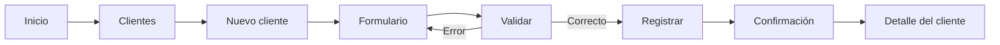
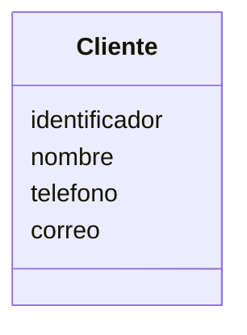
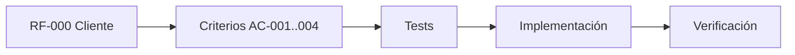

# VS-001 — Registrar cliente

## 1. Objetivo

Implementar el primer vertical slice funcional del sistema: permitir registrar un cliente y confirmar que quedó disponible para su consulta.

Se elige este slice antes de `Registrar evento` porque un evento requiere un cliente válido. De esta forma se evita introducir dependencias ficticias en el primer flujo de negocio.

## 2. Alcance

Incluye:

- mostrar formulario de alta de cliente;
- validar datos obligatorios;
- registrar el cliente;
- devolver/mostrar un identificador único;
- mostrar confirmación;
- permitir consultar el cliente recién registrado.

No incluye:

- autenticación avanzada;
- pagos;
- notificaciones externas;
- edición de cliente;
- eliminación de cliente;
- IA para enriquecer datos;
- tecnología específica de frontend/backend/persistencia.

## 3. Requisito relacionado

`RF-007 — Registrar proveedor` existe en el MVP actual, pero para este vertical slice se introduce la necesidad previa de gestionar clientes como dependencia de `RF-001 — Registrar evento`.

### Ajuste necesario

Debe incorporarse un requisito funcional específico para cliente antes de considerar el slice completo:

`RF-000 — Registrar y consultar cliente`.

## 4. Criterios de aceptación

### AC-001 — Alta válida

```text
Given el usuario está en el formulario de cliente
And proporciona los campos obligatorios válidos
When confirma el registro
Then el sistema registra el cliente
And genera un identificador único
And muestra una confirmación
```

### AC-002 — Campo obligatorio ausente

```text
Given el usuario está en el formulario de cliente
When intenta registrar sin un campo obligatorio
Then el sistema rechaza el registro
And informa qué dato debe corregirse
And no crea el cliente
```

### AC-003 — Consulta posterior

```text
Given un cliente fue registrado correctamente
When el usuario consulta el cliente mediante su identificador
Then el sistema devuelve el mismo cliente
And conserva su identidad y datos registrados
```

### AC-004 — Persistencia

```text
Given el registro fue aceptado
When termina la operación
Then el cliente queda persistido
And puede recuperarse posteriormente
```

## 5. Flujo de usuario



## 6. Wireframe conceptual

> Este wireframe describe intención funcional y distribución aproximada. No representa el diseño visual final.

```text
┌─────────────────────────────────────────────────────────┐
│ EVENTOS SOCIALES                              Usuario ▼ │
├─────────────────────────────────────────────────────────┤
│                                                         │
│  Clientes                                               │
│  ─────────────────────────────────────────────────────  │
│                                                         │
│  Nuevo cliente                                          │
│                                                         │
│  Nombre / Razón social *                                │
│  ┌───────────────────────────────────────────────────┐  │
│  │                                                   │  │
│  └───────────────────────────────────────────────────┘  │
│                                                         │
│  Teléfono                                               │
│  ┌───────────────────────────────────────────────────┐  │
│  │                                                   │  │
│  └───────────────────────────────────────────────────┘  │
│                                                         │
│  Correo                                                 │
│  ┌───────────────────────────────────────────────────┐  │
│  │                                                   │  │
│  └───────────────────────────────────────────────────┘  │
│                                                         │
│                       [Cancelar]  [Registrar cliente]  │
│                                                         │
└─────────────────────────────────────────────────────────┘
```

### Estado de confirmación

```text
┌─────────────────────────────────────────────────────────┐
│ ✓ Cliente registrado                                    │
│                                                         │
│ Cliente: Nombre del cliente                             │
│ Identificador: CLI-XXXX                                 │
│                                                         │
│ [Ver cliente]                 [Registrar otro]           │
└─────────────────────────────────────────────────────────┘
```

## 7. Contrato funcional

La interfaz de usuario debe poder expresar estas operaciones sin depender de una tecnología concreta:

```text
Crear cliente
Consultar cliente por identificador
```

El formato técnico del API se definirá en la capa de contratos/API correspondiente.

## 8. Modelo conceptual mínimo



Los nombres y tipos físicos de campos deberán alinearse con el modelo de datos vigente antes de implementar.

## 9. Tests mínimos

### Unitarios

- cliente válido puede crearse;
- nombre/razón social obligatorio;
- identificador generado es único;
- datos inválidos son rechazados.

### Integración

- cliente creado puede persistirse;
- cliente persistido puede recuperarse por identificador.

### Aceptación

- usuario completa formulario y registra cliente;
- usuario recibe confirmación;
- usuario consulta el cliente registrado.

## 10. Trazabilidad



## 11. Dependencias

- reglas generales de seguridad;
- contrato de persistencia;
- estrategia de identificadores;
- stack de implementación, cuando se seleccione;
- configuración de ejecución de tests.

## 12. Definition of Done

- [ ] requisito RF-000 incorporado a la especificación;
- [ ] criterios de aceptación revisados;
- [ ] wireframe aprobado como referencia funcional;
- [ ] contrato definido;
- [ ] tests unitarios implementados;
- [ ] tests de integración implementados cuando exista infraestructura;
- [ ] flujo de aceptación validado;
- [ ] implementación completa;
- [ ] documentación actualizada;
- [ ] seguridad revisada;
- [ ] sin secretos en el repositorio.

## 13. Siguiente paso

Antes de implementar código, actualizar `SPEC.md` y `docs/02-requisitos.md` para formalizar `RF-000`, revisar el modelo de datos y confirmar el contrato de cliente.
