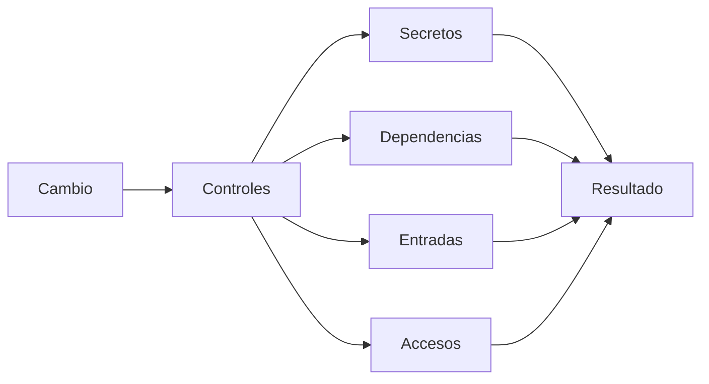

# Seguridad

## Objetivo

Establecer controles mínimos para que el desarrollo humano y asistido por agentes sea seguro desde el inicio.

## Reglas

- No almacenar secretos, tokens, API keys ni credenciales en Git.
- No confiar en validaciones realizadas únicamente en frontend.
- Aplicar mínimo privilegio a agentes y herramientas.
- Revisar cambios que afecten autenticación, autorización, datos sensibles o infraestructura.
- No permitir que una skill, memoria o prompt invalide controles de seguridad.
- No incorporar dependencias sin revisar su necesidad y origen.

## Flujo

## Fuera de alcance de MVP-00

No se implementan todavía autenticación avanzada, gestión de identidades, WAF ni infraestructura de seguridad compleja. Se documentarán cuando sean necesarias para el producto.
