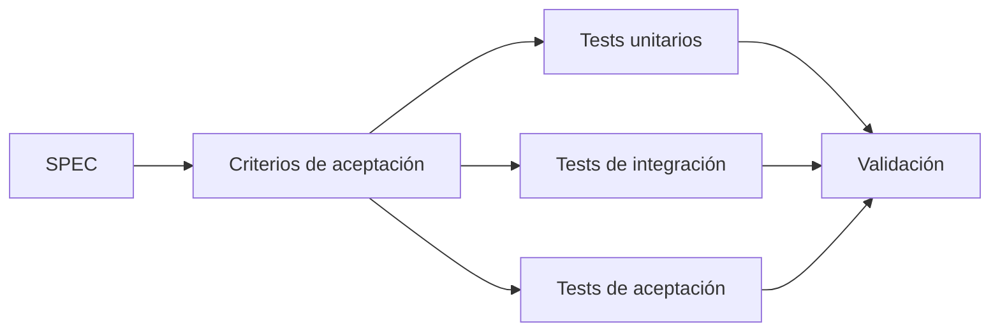

# Tests

Los tests son evidencia ejecutable del comportamiento esperado.



## Estructura

```text
tests/
├── unit/
├── integration/
└── acceptance/
```

- `unit/`: reglas de negocio y componentes aislados.
- `integration/`: interacción entre componentes o servicios.
- `acceptance/`: validación de criterios de aceptación cuando resulte apropiado.

La implementación concreta dependerá del lenguaje y framework seleccionados mediante una decisión documentada.

## Regla para agentes

Un cambio funcional debe incluir o actualizar pruebas relevantes. Si no es posible probar una parte del comportamiento, el agente debe explicarlo y no asumir que el cambio está validado.
